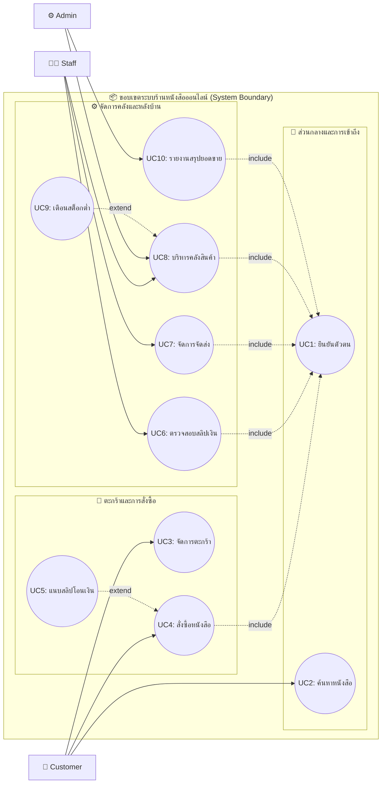
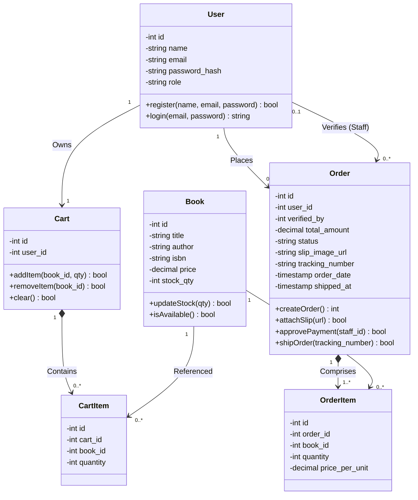
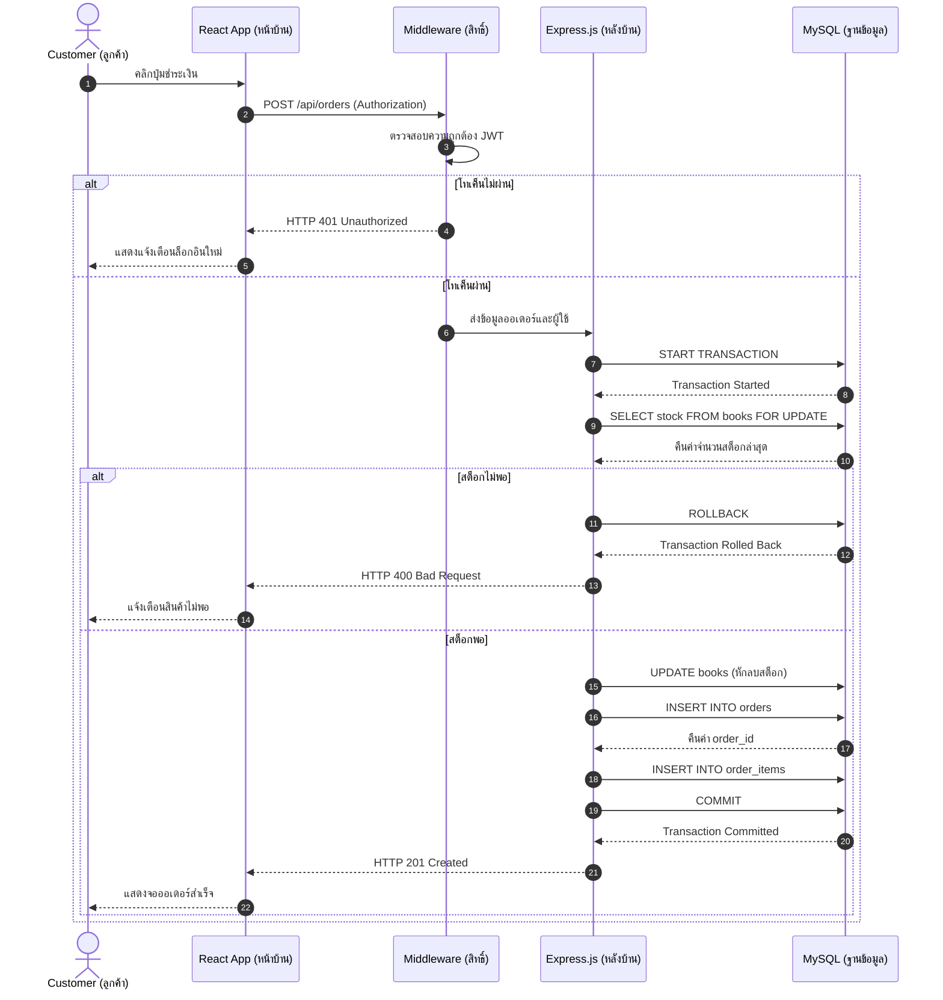
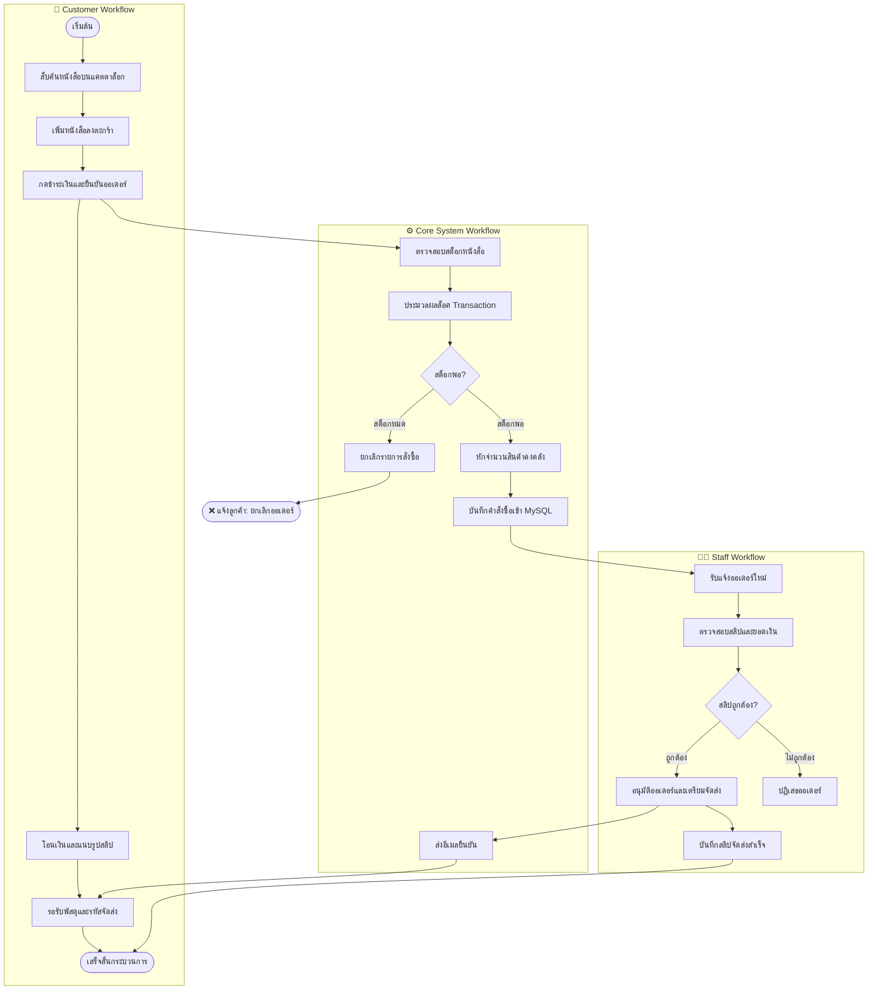
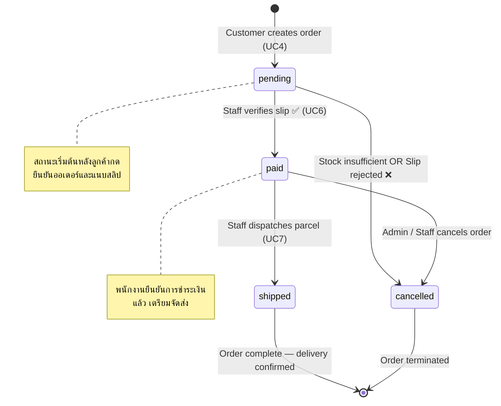
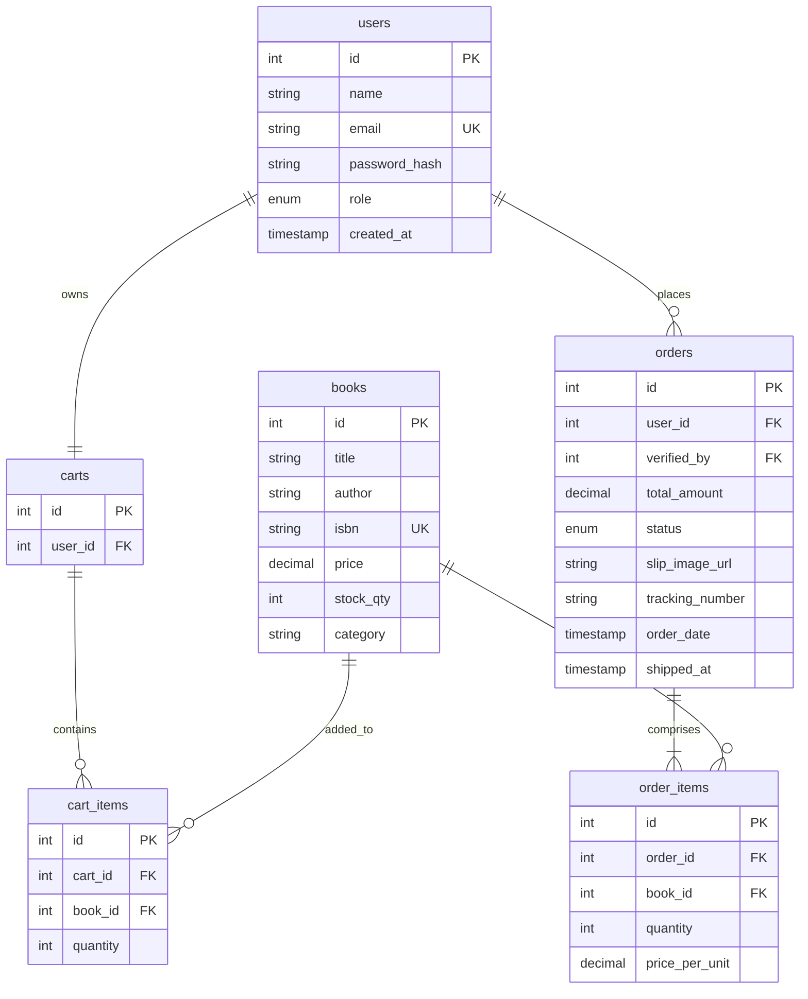
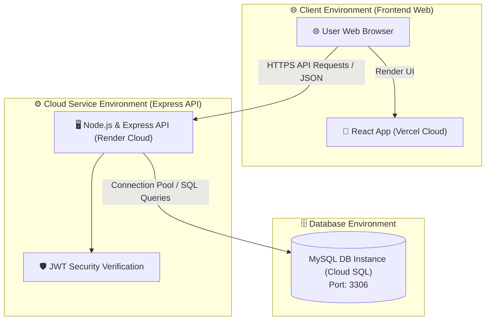

# 📊 ระบบจำหน่ายหนังสือออนไลน์ (Online Book Store System)
> เอกสารส่งมอบชิ้นงานสถาปัตยกรรมและการออกแบบระบบเชิงลึก (CSI204)

---

## 📋 1. Use Case Diagram & Specification (ขอบเขตระบบและการวิเคราะห์การใช้งาน)

แผนภาพยกระดับขอบเขตของระบบ (System Boundary) เพื่อแจกแจงกรณีการใช้งานเชิงลึก โดยระบุความสัมพันธ์แบบ `<<include>>` สำหรับการยืนยันตัวตนในกิจกรรมสำคัญ และแยกระดับสิทธิ์เข้าถึงระหว่าง ลูกค้า (Customer), พนักงานจัดการสต็อก (Staff) และผู้ดูแลระบบวิเคราะห์ข้อมูล (Admin) ไว้อย่างเด็ดขาด



### ตารางแจกแจงรายละเอียดสิทธิ์การใช้งาน (Use Case Specification Matrix)

| รหัสและชื่อ Use Case | ผู้มีสิทธิ์ (Actors) | เงื่อนไขและคำอธิบาย |
| :--- | :--- | :--- |
| **UC1: ยืนยันตัวตนเข้าระบบ** | ลูกค้า, พนักงาน, ผู้ดูแลระบบ | ตรวจสอบ email/password แล้วสร้าง JWT Token สำหรับควบคุมการเข้าถึง API |
| **UC2: ค้นหาหนังสือ** | ลูกค้า (Customer) | สืบค้นหนังสือจากชื่อ, ผู้แต่ง, ISBN หรือหมวดหมู่ ไม่ต้องล็อกอินก็ใช้งานได้ |
| **UC3: จัดการตะกร้าสินค้า** | ลูกค้า (Customer) | เพิ่ม/ลบ/ปรับจำนวนหนังสือในตะกร้า ระบบตรวจสอบสต็อกก่อนยืนยัน |
| **UC4: สั่งซื้อและแนบหลักฐาน** | ลูกค้า (Customer) | คำนวณราคาสุทธิ, ตัดสต็อกด้วย Transaction Lock และสร้าง Order |
| **UC5: แนบสลิปโอนเงิน** | ลูกค้า (Customer) | «extend» UC4 — อัปโหลดไฟล์ภาพสลิปผูกกับ order_id |
| **UC6: ตรวจสอบสลิปเงิน** | พนักงาน (Staff) | ดูรายการออเดอร์ค้างอนุมัติ ตรวจยืนยันสลิปและอัปเดต status เป็น "paid" |
| **UC7: จัดการจัดส่ง** | พนักงาน (Staff) | บันทึกเลขพัสดุและวันที่จัดส่ง อัปเดต status ออเดอร์เป็น "shipped" |
| **UC8: บริหารคลังสินค้า** | พนักงานหลังบ้าน, ผู้ดูแลระบบ | เพิ่ม/ลบ/แก้ไขข้อมูลหนังสือ จัดการหมวดหมู่ และปรับปรุงสต็อก Real-time |
| **UC9: เตือนสต็อกต่ำ** | ระบบ → พนักงาน | «extend» UC8 — แจ้งเตือนอัตโนมัติเมื่อ stock_qty ต่ำกว่าเกณฑ์ |
| **UC10: รายงานสรุปยอดขาย** | ผู้ดูแลระบบ (Admin) | แสดง Dashboard สรุปยอดขาย, หนังสือขายดี, รายรับรายสัปดาห์/เดือน |

---

## 🏗️ 2. Class Diagram & Entity Attributes (โครงสร้างความสัมพันธ์ของคลาสข้อมูล)

แผนภาพคลาสเชิงวัตถุระบุข้อมูลจำเพาะ (Data Specifications) ของชุดข้อมูล ประกอบด้วยชนิดข้อมูล (Data Type), สิทธิ์การเข้าถึง (Access Modifier) เช่น Private (-) และ Public (+) รวมถึงฟังก์ชันบริการภายในตัวคลาส:



---

## 🔄 3. Sequence Diagram (ลำดับขั้นตอนการตรวจสอบและชำระเงินเชิงลึก)

แผนภาพจำลองปฏิสัมพันธ์ในลักษณะเวลา (Timeline Base) อธิบายกระบวนการสั่งซื้อสินค้าและการตัดจำนวนคลังสินค้า โดยประยุกต์ใช้ Database Transaction และ Pessimistic Locking:



---

## 🔄 4. Activity Diagram (แผนภาพแสดงลำดับเวิร์กโฟลว์ผู้ใช้ข้ามบทบาท)

แผนภาพกิจกรรม (Activity Diagram) แสดงการไหลของกระบวนการสั่งซื้อหนังสือข้ามระบบผู้ใช้แบบ Swimlanes:



---

## 📌 5. State Diagram (วงจรชีวิตสถานะของคำสั่งซื้อ Order)

แผนภาพสถานะ (State Diagram) แสดงการเปลี่ยนสถานะของ Order ตลอด Lifecycle ตั้งแต่ลูกค้ากดยืนยัน จนพัสดุถูกจัดส่งหรือออเดอร์ถูกยกเลิก:



---

## 💾 6. Database ERD (การออกแบบความสัมพันธ์ฐานข้อมูล MySQL 3NF)

แผนภาพความสัมพันธ์ของเอนทิตี (Entity-Relationship Diagram) แสดงรูปแบบฐานข้อมูลจริงที่รันในโปรดักชัน ซึ่งแยกส่วนของตารางกลางแบบ Normalized (3NF):



---

## 🚀 7. Deployment Architecture (สถาปัตยกรรมทางกายภาพและการติดตั้งจริง)

แผนภาพจำลองการติดตั้งระบบบน Cloud แยกสภาพแวดล้อมฝั่ง Client (React บน Vercel) และ Backend (Node.js & Express บน Render) เชื่อมสู่ MySQL:



---

## 💾 8. Data Schema Specification (JSON Contract Payload)

โครงสร้างข้อมูลระดับลึก (Data Contract Payload) ที่ใช้ทดสอบสัญญาความถูกต้องในการผูกระบบระหว่างหน้าบ้านและ API หลังบ้าน:

```json
{
  "transaction_metadata": {
    "environment": "production-v1",
    "api_version": "1.0.4"
  },
  "order_id": 40291,
  "customer_details": {
    "student_user_id": 67120669,
    "fullname": "Siradech Sriam",
    "shipping_address": "99/1 ถนนวิภาวดีรังสิต ดินแดง กรุงเทพฯ"
  },
  "items": [
    {
      "book_id": 101,
      "title": "คู่มือการพัฒนาซอฟต์แวร์แพลตฟอร์มด้วย React",
      "quantity": 2,
      "price_per_unit": 250.00
    },
    {
      "book_id": 105,
      "title": "Introduction to RDBMS & MySQL Architecture",
      "quantity": 1,
      "price_per_unit": 390.00
    }
  ],
  "financials": {
    "subtotal": 890.00,
    "shipping_fee": 0.00,
    "grand_total": 890.00
  },
  "payment_status": "Verified_Success",
  "is_dispatched": true
}
```

---

## 🚀 9. แหล่งเก็บซอร์สโค้ดและรายงานความคืบหน้า (Project Deliverables)

### 👥 โครงสร้างทีมและบทบาทหน้าที่

| รายชื่อสมาชิก | บทบาทหน้าที่ (Role) | ขอบเขตความรับผิดชอบหลัก |
| :--- | :--- | :--- |
| **นายศิระเดช ศรีอ่ำ** (67120669) | 🛂 Customer System Developer | ฟังก์ชันลูกค้าทั้งหมด (Storefront, ค้นหาหนังสือ, ตะกร้า, สั่งซื้อ/แนบสลิป) |
| **นายกิตติวัฒน์ กุดั่น** (67107666) | 🧑‍💼 Admin System Developer | ฟังก์ชันพนักงาน/แอดมิน (อนุมัติสลิปและจัดการจัดส่งสินค้า) |
| **นายศุภวิชญ์ เชื้อสาทุม** (67125897) | ⚙️ Super Admin / Backend & DBA | Super Admin Dashboard, MySQL, REST API |

### 📈 ตารางสถานะชิ้นงาน (Progress Checklist)

| กิจกรรม/งานส่งมอบ | สถานะ | ผู้รับผิดชอบ |
| :--- | :---: | :--- |
| 1. เอกสารสถาปัตยกรรมระบบ (Use Case, Class, Sequence) | ✅ 100% | นายศิระเดช ศรีอ่ำ (PM) |
| 2. การออกแบบโครงสร้างฐานข้อมูล (MySQL Schema ERD) | ✅ 100% | นายศุภวิชญ์ เชื้อสาทุม (DBA) |
| 3. พัฒนา React Storefront UI | ✅ 100% | นายศิระเดช, นายกิตติวัฒน์ |
| 4. พัฒนา Core RESTful API และ Transaction Lock | ✅ 100% | นายศุภวิชญ์ เชื้อสาทุม |
| 5. API Automation Testing (Postman) | ✅ 100% | นายศุภวิชญ์ เชื้อสาทุม |
| 6. User Acceptance Testing (UAT Manual) | ✅ 100% | นายกิตติวัฒน์ กุดั่น (QA) |

📂 **GitHub Repository:** [https://github.com/SupvichSpuGM/online-bookstore](https://github.com/SupvichSpuGM/online-bookstore)
