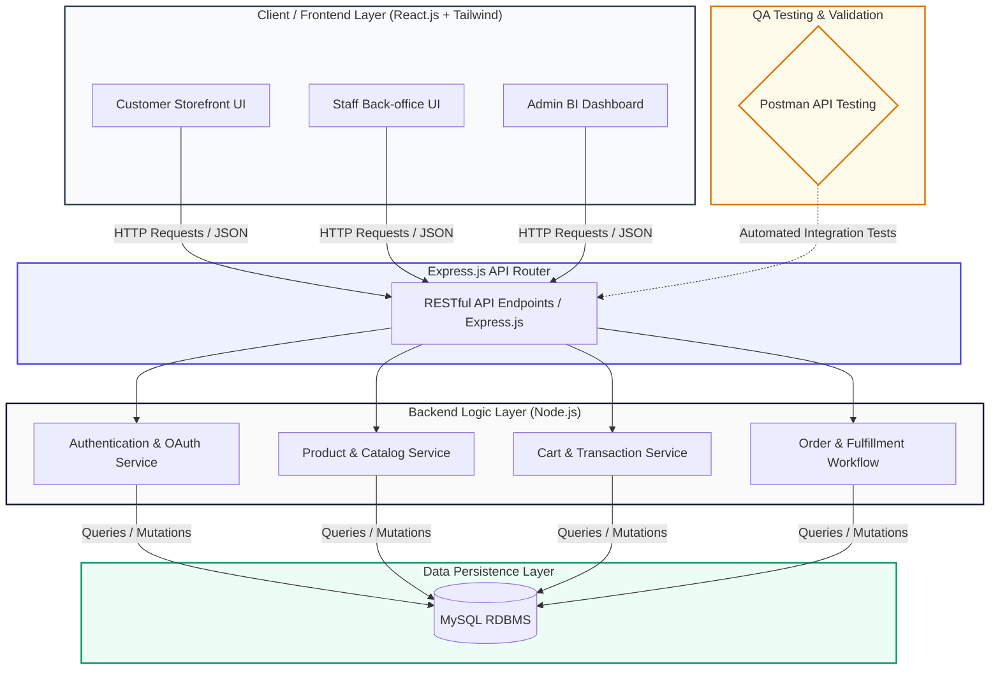

# 📚 E-Commerce Platform for Online Bookstore
> ระบบแพลตฟอร์มอีคอมเมิร์ซสำหรับร้านค้าหนังสือออนไลน์ — โครงงานกลุ่มวิชา CSI204 ดิจิทัลแพลตฟอร์มสำหรับพัฒนาซอฟต์แวร์ (ภาคการศึกษา 3/2568)

---

## 📂 เอกสารโครงงาน (Project Documents)

| ไฟล์ | คำอธิบาย |
| :--- | :--- |
| 📄 [README.md](./README.md) | ภาพรวมโครงงาน ทีม เทคโนโลยี และแผนการดำเนินงาน |
| 📊 [Diagram.md](./Diagram.md) | แผนภาพสถาปัตยกรรมระบบ (Use Case, Class, Sequence, ERD, Deployment) |
| 📝 [workshop4.md](./workshop4.md) | Workshop #4: Theoretical Assessment — การวิเคราะห์และออกแบบระบบ |

---

## 👥 1. โครงสร้างทีมและบทบาทหน้าที่ (Team Structure & Roles Allocation)
โครงสร้างทีมในลักษณะ Lean Cross-Functional (สมาชิก 3 คน) ควบคุมและจัดการกระบวนการพัฒนาตลอดจนการทำ API Automation Testing:

* **นายศิระเดช ศรีอ่ำ (รหัสนักศึกษา: 67120669)**
  * **Role:** Project Manager / UI UX Designer / Frontend Developer
  * **Responsibilities:**
    * บริหารจัดการ Sprint, ไทม์ไลน์ภาพรวมของโปรเจกต์ และติดตามสถานะความคืบหน้าของงาน (Project Management)
    * ออกแบบ User Journey, Wireframe และ High-Fidelity UI บน Figma
    * พัฒนาหน้าเว็บ Component และ Interface (Frontend) ฝั่งระบบหลังบ้านพนักงาน (Staff) และผู้ดูแลระบบ (Admin)

* **นายกิตติวัฒน์ กุดั่น (รหัสนักศึกษา: 67107666)**
  * **Role:** Frontend Developer / Quality Assurance (QA Browser Tester)
  * **Responsibilities:**
    * พัฒนา UI Web Components ฝั่งลูกค้าร้านค้าออนไลน์ (Customer Storefront) ด้วย React และ Tailwind CSS
    * ทำ Frontend-Backend Integration ร่วมเชื่อมต่อระบบหน้าบ้านเข้ากับชุด RESTful API
    * จัดทำเอกสาร Test Cases เพื่อทำ Manual Testing และระบบประเมิน User Acceptance Testing (UAT) บนเบราว์เซอร์

* **นายศุภวิชญ์ เชื้อสาทุม (รหัสนักศึกษา: 67125897)**
  * **Role:** Backend Developer / Database Administrator / API Test Engineer
  * **Responsibilities:**
    * ออกแบบและจัดทำสถาปัตยกรรมฐานข้อมูลเชิงสัมพันธ์ด้วย **MySQL** *(ยกระดับประสิทธิภาพความปลอดภัยข้อมูลทดแทนระบบ Local Storage เดิม)*
    * พัฒนา Core RESTful API ด้วย **Node.js & Express.js** (ระบบ Authentication, Order logic และ Real-time Stock)
    * เขียนเทสสคริปต์และรับผิดชอบการทำ **API Testing ผ่าน Postman** เพื่อควบคุมคุณภาพซอฟต์แวร์ก่อนการผูกระบบ

---

## 📝 2. รายละเอียดโครงงาน (Project Information)
* **ชื่อโครงงาน (ภาษาไทย):** ระบบจำหน่ายหนังสือออนไลน์
* **ชื่อโครงงาน (ภาษาอังกฤษ):** Online Book Store System
* **Domain:** e-Commerce

---

## 💡 3. หลักการและเหตุผล (Rationale)
ในปัจจุบัน พฤติกรรมการบริโภคสื่อและหนังสือของประชากรได้ปรับเปลี่ยนไปสู่รูปแบบออนไลน์มากขึ้นเนื่องจากความสะดวกสบาย รวดเร็ว และสามารถเข้าถึงได้ทุกที่ทุกเวลา อย่างไรก็ตาม ร้านหนังสืออิสระหรือผู้ประกอบการขนาดเล็กหลายแห่งยังขาดแพลตฟอร์มดิจิทัลที่มีประสิทธิภาพในการบริหารจัดการระบบร้านค้าออนไลน์ ทั้งในด้านการจัดการคลังสินค้า การประมวลผลคำสั่งซื้อ และการมอบประสบการณ์การใช้งานที่ดีให้แก่ลูกค้า 

คณะผู้พัฒนาจึงได้เล็งเห็นถึงความสำคัญนี้และนำเสนอโครงงาน "ระบบจำหน่ายหนังสือออนไลน์" เพื่อเป็นแนวทางในการพัฒนาแพลตฟอร์ม e-Commerce ที่ตอบโจทย์การใช้งานจริง โดยบูรณาการองค์ความรู้ตามกระบวนการพัฒนาซอฟต์แวร์อย่างเป็นระบบ เพื่อช่วยส่งเสริมช่องทางการจำหน่ายและอำนวยความสะดวกให้แก่ผู้ซื้อและผู้ขายอย่างยั่งยืน

---

## 🎯 4. วัตถุประสงค์ของโครงงาน (Objectives)
1. เพื่อออกแบบและพัฒนาระบบจำหน่ายหนังสือออนไลน์ที่มีฟังก์ชันการทำงานครบถ้วน มีสถาปัตยกรรมหลังบ้านที่มั่นคง และใช้งานง่ายสำหรับผู้ใช้ทุกกลุ่ม
2. เพื่อศึกษาและประยุกต์ใช้วงจรการพัฒนาซอฟต์แวร์ (SDLC) ในการบริหารจัดการโครงการแบบ Lean Team อย่างมีประสิทธิภาพ
3. เพื่อเพิ่มทักษะของสมาชิกในการพัฒนา Full-stack แอปพลิเคชัน และการทำ Automated API Testing เพื่อควบคุมคุณภาพของระบบก่อนนำไปใช้งานจริง

---

## 🔍 5. ขอบเขตของระบบ (System Scope)

### ผู้ใช้งาน (Actors)
* [x] ลูกค้า (Customer)
* [x] พนักงาน (Staff)
* [x] ผู้ดูแลระบบ (Administrator)

### ความสามารถหลักของระบบ (Main Functions)
1. **ระบบจัดการสมาชิกและยืนยันตัวตน:** การสมัครสมาชิก, การเข้าสู่ระบบ (Authentication) และการจัดการโปรไฟล์ส่วนตัว
2. **ระบบสืบค้นและแสดงหน้าร้าน:** การค้นหาหนังสือตามหมวดหมู่ ชื่อผู้แต่ง หรือชื่อเรื่อง พร้อมแสดงรายละเอียด ราคา และข้อมูลคลังสินค้า
3. **ระบบตะกร้าสินค้าและการสั่งซื้อ:** การเพิ่ม/ลดจำนวนหนังสือในตะกร้า, การคำนวณราคาสินค้า, และระบบการประมวลผลคำสั่งซื้อ (Order Logic)
4. **ระบบชำระเงินและติดตามสถานะ:** การอัปโหลดหลักฐานการโอนเงิน และการจัดการสเตตัสการจัดส่งสินค้า (Fulfillment Workflow)
5. **ระบบจัดการหลังบ้าน (Back-office Management & Dashboard):** ระบบสำหรับพนักงานและแอดมินในการ เพิ่ม ลบ แก้ไขข้อมูลหนังสือ ปรับปรุงสต็อกแบบ Real-time และสรุปรายงานยอดขายข้อมูลหลังบ้าน

---

## 🏗️ 6. แผนผังแสดงสถาปัตยกรรมระบบ (System Architecture Diagram)
ระบบทำงานภายใต้สถาปัตยกรรม Client-Server Model แยกส่วน Client และ Server ออกจากกันอย่างเด็ดขาด โดยมีการควบคุมสัญญาการรับส่งข้อมูลผ่านโครงสร้าง JSON และสแกนสิทธิด้วย Postman ก่อนบันทึกลง MySQL:

## 🛠️ 7. เครื่องมือและเทคโนโลยีที่ใช้ (Tools & Technologies)

### 💻 Frontend (Client-Side Layer)
* **React.js (v18+)** — ไลบรารีหลักสำหรับจัดการโครงสร้าง State และพัฒนา User Interface ในรูปแบบ Component-based ที่รองรับการทำงานซ้ำได้อย่างมีประสิทธิภาพ
* **Tailwind CSS** — ยูทิลิตี้เฟรมเวิร์กสำหรับการดีไซน์หน้าจอแบบ Utility-First ช่วยให้ระบบหน้าบ้านมีความเป็น Modern, Clean และรองรับการแสดงผลแบบ Responsive ในทุกขนาดหน้าจอ
* **HTML5 / CSS3 / JavaScript (ES6+)** — ภาษามาตรฐานและเทคโนโลยีแกนหลักในการขับเคลื่อนโครงสร้างและการทำงานของเว็บแอปพลิเคชัน

### ⚙️ Backend & Database (Server-Side Layer)
* **Node.js & Express.js** — สภาพแวดล้อมรันไทม์และมิดเดิลแวร์เฟรมเวิร์กประสิทธิภาพสูง ในการสร้างบริการฝั่ง Server รวมถึงการจัดการชุดเส้นทาง RESTful API Endpoints
* **MySQL RDBMS** — ระบบจัดการฐานข้อมูลเชิงสัมพันธ์ เพื่อเพิ่มความปลอดภัย ความเสถียร และรองรับข้อมูลที่มีความสัมพันธ์ซับซ้อน (ยกระดับขึ้นเพื่อทดแทนระบบ Local Storage แบบเดิม)

### 🎨 Design & Collaboration Tools
* **Figma** — เครื่องมือหลักที่ใช้จัดทำ User Journey, Wireframe ไปจนถึงการขึ้นแบบจำลองหน้าจอความละเอียดสูง (High-Fidelity UI) ของระบบหน้าบ้านและหลังบ้านทั้งหมด
* **GitHub** — แพลตฟอร์มหลักสำหรับการทำ Version Control ควบคุมการจัดการซอร์สโค้ดผ่าน Branching Strategy และขับเคลื่อนการทำงานร่วมกันภายในทีมแบบ Agile

---

## 🧪 8. แนวทางการทดสอบระบบ (Testing Approach)

ระบบแบ่งกระบวนการควบคุมคุณภาพซอฟต์แวร์ (Quality Assurance) ออกเป็น 2 ส่วนหลัก เพื่อรับประกันทั้งในด้านความถูกต้องของ Logic และประสบการณ์การใช้งานจริง:

### 1️⃣ API Testing (Automation & Contract Verification)
* **Objective:** ตรวจสอบความสมบูรณ์ ความถูกต้อง และความปลอดภัยของชุดข้อมูลก่อนเริ่มกระบวนการผูกระบบ
* **Methodology:** ใช้เครื่องมือ **Postman** ในการเขียนสคริปต์ทำ Automation Test เพื่อตรวจจับโครงสร้าง JSON Payload, ตรวจสอบความถูกต้องของสิทธิ และประเมิน HTTP Status Codes ทุกเส้นทาง
* **Responsible:** Backend & API Test Engineer

### 2️⃣ User Acceptance Testing (UAT)
* **Objective:** ประเมินความลื่นไหล ความพึงพอใจ และความถูกต้องของฟังก์ชันการใช้งานจากมุมมองของผู้ใช้จริง
* **Methodology:** ดำเนินการทดสอบแบบ **Manual Testing** ผ่านเว็บเบราว์เซอร์ โดยอ้างอิงและบันทึกผลอย่างเป็นระบบตามเอกสารใบรายการทดสอบ (Test Cases) ที่ทีมดีไซน์และออกแบบไว้ล่วงหน้า
* **Responsible:** QA Browser Tester

---

## 📊 9. ผลลัพธ์ที่คาดว่าจะได้รับ (Expected Outcomes)

* **[✓] Production-Ready Platform**  
  ได้แพลตฟอร์มอีคอมเมิร์ซร้านจำหน่ายหนังสือออนไลน์ที่มีฟังก์ชันการทำงานสมบูรณ์ครบถ้วน พร้อมตอบโจทย์กลุ่มผู้ใช้งานทั้ง 3 กลุ่มหลัก (ลูกค้า, พนักงาน, และผู้ดูแลระบบ) ได้จริงตามขอบเขต
* **[✓] Secure & Scalable Database**  
  สถาปัตยกรรมฐานข้อมูล MySQL สามารถจัดเก็บข้อมูลการยืนยันตัวตน, คลังสินค้า และประวัติคำสั่งซื้อได้อย่างมั่นคง ถูกต้องปลอดภัย ไม่สูญหายเหมือนการเก็บข้อมูลรูปแบบเดิม
* **[✓] High-Quality Softwares (Low Defect Rate)**  
  ซอฟต์แวร์ผ่านกระบวนการคัดกรองบั๊กอย่างเข้มงวดทั้งในระดับ API Layer (Postman) และ UI Layer (Manual UI Test) ช่วยลดความเสี่ยงและการเกิดข้อผิดพลาดรุนแรงเมื่อนำไปเปิดใช้งานจริง
* **[✓] Lean Cross-Functional Engineering Skills**  
  สมาชิกภายในทีมได้รับประสบการณ์จริงในการทำงานร่วมกันแบบ Lean Team พัฒนาทักษะ Full-stack Development และเข้าใจกระบวนการทดสอบตามวงจร SDLC อย่างเป็นระบบ

---

## 📅 10. แผนการดำเนินงาน 4 สัปดาห์ (Work Plan: 4 Weeks)

| สัปดาห์ (Week) | กิจกรรมหลัก (Activities) | รายละเอียดของงานโดยย่อ (Brief Description) | ผู้รับผิดชอบหลัก (Assigned Members) |
| :---: | :--- | :--- | :--- |
| **สัปดาห์ที่ 1** | **วิเคราะห์และออกแบบระบบ** *(Analysis & Design)* | <ul><li>ประชุมรวบรวมข้อกำหนดและขอบเขตความต้องการระบบ (Requirements)</li><li>จัดทำ User Journey และออกแบบ UI ความละเอียดสูงบน Figma</li><li>ออกแบบสถาปัตยกรรมระบบ และโครงสร้างฐานข้อมูลเชิงสัมพันธ์ (MySQL ER-Diagram)</li></ul> | **ทุกคนในทีม** *(ประสานงานร่วมกัน)* |
| **สัปดาห์ที่ 2** | **พัฒนาฟังก์ชันระยะแรก** *(Development Sprint 1)* | <ul><li>พัฒนาหน้าจอฝั่งลูกค้าร้านค้าออนไลน์ (Customer Storefront Web UI)</li><li>พัฒนา Core Backend API สเตจแรก (ระบบ Authentication ยืนยันตัวตน และ Product Catalog API)</li></ul> | <ul><li>นายศิระเดช (Customer Developer)</li><li>นายกิตติวัฒน์ (Admin Developer)</li><li>นายศุภวิชญ์ (Super Admin/Backend)</li></ul> |
| **สัปดาห์ที่ 3** | **พัฒนาฟังก์ชันระยะสอง** *(Development Sprint 2)* | <ul><li>พัฒนาหน้าจอฝั่งระบบหลังบ้านพนักงาน (Staff UI) และหน้าต่างสรุปผล (Admin Dashboard)</li><li>พัฒนา Backend API สเตจสอง (ระบบ Cart Logic, Order Workflow และ Real-time Stock)</li><li>เริ่มต้นกระบวนการเชื่อมต่อหน้าบ้านและหลังบ้านเข้าด้วยกัน (Frontend-Backend Integration)</li></ul> | <ul><li>นายศิระเดช (Customer Developer)</li><li>นายกิตติวัฒน์ (Admin Developer)</li><li>นายศุภวิชญ์ (Super Admin/Backend)</li></ul> |
| **สัปดาห์ที่ 4** | **ทดสอบระบบและนำเสนอ** *(Testing & Presentation)* | <ul><li>เขียนและรันสคริปต์ทำ API Automation Testing ผ่านเครื่องมือ Postman</li><li>ดำเนินการทดสอบ Manual Browser Testing และประเมินผล UAT ตามใบ Test Cases</li><li>สรุปรายงานข้อผิดพลาด เคลียร์บั๊ก จัดทำเอกสารเล่มรายงานฉบับสมบูรณ์ และนำเสนอโครงงาน</li></ul> | **ทุกคนในทีม** *(เน้นส่วนงาน QA และ PM)* |