# 📊 ระบบจำหน่ายหนังสือออนไลน์ (Online Book Store System)
> เอกสารส่งมอบชิ้นงานสถาปัตยกรรมและการออกแบบระบบเชิงลึก (CSI204)

---

## 📋 1. Use Case Diagram & Specification (ขอบเขตระบบและการวิเคราะห์การใช้งาน)

แผนภาพยกระดับขอบเขตของระบบ (System Boundary) เพื่อแจกแจงกรณีการใช้งานเชิงลึก โดยระบุความสัมพันธ์แบบ `<<include>>` สำหรับการยืนยันตัวตนในกิจกรรมสำคัญ และแยกระดับสิทธิ์เข้าถึงระหว่าง ลูกค้า (Customer), พนักงานจัดการสต็อก (Staff) และผู้ดูแลระบบวิเคราะห์ข้อมูล (Admin) ไว้อย่างเด็ดขาด

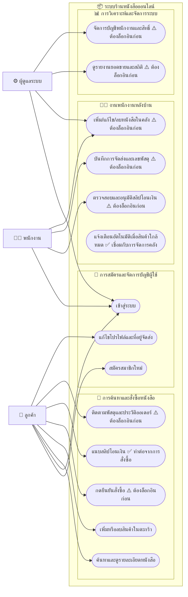
```mermaid
graph LR
    Customer["👤 ลูกค้า"]
    Staff["🧑‍💼 พนักงาน"]
    Admin["⚙️ ผู้ดูแลระบบ"]

    subgraph System ["📦 ระบบร้านหนังสือออนไลน์"]
        subgraph G1 ["🔐 การสมัครและจัดการบัญชีผู้ใช้"]
            UC_Register(["สมัครสมาชิกใหม่"])
            UC_Auth(["เข้าสู่ระบบ"])
            UC_Profile(["แก้ไขโปรไฟล์และที่อยู่จัดส่ง"])
        end
        subgraph G2 ["🛒 การค้นหาและสั่งซื้อหนังสือ"]
            UC_Search(["ค้นหาและดูรายละเอียดหนังสือ"])
            UC_Cart(["เพิ่มหรือลบสินค้าในตะกร้า"])
            UC_Checkout(["กดยืนยันสั่งซื้อ ⚠️ ต้องล็อกอินก่อน"])
            UC_UploadSlip(["แนบสลิปโอนเงิน ✅ ทำต่อจากการสั่งซื้อ"])
            UC_OrderHistory(["ติดตามพัสดุและประวัติออเดอร์ ⚠️ ต้องล็อกอินก่อน"])
        end
        subgraph G3 ["🧑‍💼 งานพนักงานหลังบ้าน"]
            UC_VerifySlip(["ตรวจสอบและอนุมัติสลิปโอนเงิน ⚠️ ต้องล็อกอินก่อน"])
            UC_ShipOrder(["บันทึกการจัดส่งและเลขพัสดุ ⚠️ ต้องล็อกอินก่อน"])
            UC_ManageCatalog(["เพิ่ม/แก้ไข/ลบหนังสือในคลัง ⚠️ ต้องล็อกอินก่อน"])
            UC_StockAlert(["แจ้งเตือนอัตโนมัติเมื่อสินค้าใกล้หมด ✅ เชื่อมกับการจัดการคลัง"])
        end
        subgraph G4 ["📊 การวิเคราะห์และจัดการระบบ"]
            UC_Dashboard(["ดูรายงานยอดขายและสถิติ ⚠️ ต้องล็อกอินก่อน"])
            UC_ManageUsers(["จัดการบัญชีพนักงานและสิทธิ์ ⚠️ ต้องล็อกอินก่อน"])
        end
    end

    Customer --> UC_Register
    Customer --> UC_Auth
    Customer --> UC_Search
    Customer --> UC_Cart
    Customer --> UC_Checkout
    Customer --> UC_UploadSlip
    Customer --> UC_OrderHistory
    Customer --> UC_Profile

    Staff --> UC_Auth
    Staff --> UC_VerifySlip
    Staff --> UC_ShipOrder
    Staff --> UC_ManageCatalog

    Admin --> UC_Auth
    Admin --> UC_ManageCatalog
    Admin --> UC_Dashboard
    Admin --> UC_ManageUsers


```

### ตารางแจกแจงรายละเอียดสิทธิ์การใช้งาน (Use Case Specification Matrix)

| รหัสและชื่อ Use Case | ผู้มีสิทธิ์ (Actors) | เงื่อนไขและคำอธิบาย |
| :--- | :--- | :--- |
| **UC1: สมัครสมาชิก** | ลูกค้าผู้ใช้งานใหม่ | ลงทะเบียนสร้างบัญชีลูกค้าใหม่โดยระบุ ชื่อ, อีเมล, รหัสผ่าน และข้อมูลที่อยู่เริ่มต้น ระบบทำการบันทึกอย่างปลอดภัย |
| **UC2: เข้าสู่ระบบและยืนยันตัวตน** | ลูกค้า, พนักงาน, ผู้ดูแลระบบ | ตรวจสอบ email/password แล้วสร้าง JWT Token ที่มีอายุการใช้งาน สำหรับควบคุมและสแกนสิทธิ์การเข้าถึงข้อมูลหลังบ้าน |
| **UC3: ค้นหาและดูรายละเอียดหนังสือ** | ลูกค้า / บุคคลทั่วไป | สืบค้นหนังสือจากชื่อ, ชื่อผู้แต่ง, ISBN หรือหมวดหมู่ พร้อมแสดงรายละเอียด ราคา และข้อมูลคลังสินค้า โดยไม่ต้องล็อกอิน |
| **UC4: จัดการตะกร้าสินค้า** | ลูกค้า (Customer) | เพิ่ม/ลด/ปรับจำนวนเล่มหนังสือในตะกร้าช็อปปิ้งส่วนตัว ระบบทำการดึงสต็อกคอยควบคุมปริมาณ |
| **UC5: สั่งซื้อหนังสือ** | ลูกค้า (Customer) | «include» UC2 — ตรวจสอบและประมวลผลคำสั่งซื้อ คำนวณราคาหักส่วนลด ล็อกจำนวนสต็อกจริงด้วย Pessimistic Locking และสร้างใบสั่งซื้อสถานะ pending |
| **UC6: แนบสลิปโอนเงิน** | ลูกค้า (Customer) | «extend» UC5 — ลูกค้าทำการอัปโหลดสลิปหลักฐานการชำระเงินโอนผูกกับ order_id เพื่อส่งให้พนักงานเข้าตรวจสอบคิว |
| **UC7: ติดตามพัสดุและประวัติสั่งซื้อ** | ลูกค้า (Customer) | «include» UC2 — เข้าส่องดูสถานะออเดอร์ (pending, paid, shipped, cancelled) และแสดงเลข Tracking Number พร้อมลิงก์ขนส่ง |
| **UC8: จัดการโปรไฟล์และที่อยู่จัดส่ง** | ลูกค้า (Customer) | «include» UC2 — แก้ไขข้อมูลบัญชี เบอร์ติดต่อ และจัดระเบียบข้อมูลที่อยู่จัดส่งสำหรับออเดอร์ถัดไป |
| **UC9: ตรวจสอบและอนุมัติสลิปโอนเงิน** | พนักงาน (Staff) | «include» UC2 — พนักงานเปิดดูลายน้ำและรูปภาพหลักฐานการโอน หากถูกต้องจะกดยืนยันแล้วปรับสถานะออเดอร์เป็น paid |
| **UC10: จัดการการจัดส่งและระบุเลขพัสดุ** | พนักงาน (Staff) | «include» UC2 — แพ็คสินค้าจัดส่งพัสดุ บันทึกเลขขนส่ง Tracking Number เข้าออเดอร์ และปรับสถานะเป็น shipped |
| **UC11: บริหารจัดการคลังสินค้าและสต็อก** | พนักงานหลังบ้าน, ผู้ดูแลระบบ | «include» UC2 — เพิ่มหนังสือใหม่ ลบรายการที่หมดอายุ หรือแก้ไขข้อมูลราคา รายละเอียด และจำนวนสต็อกสินค้าในคลัง |
| **UC12: แจ้งเตือนสต็อกสินค้าต่ำ** | ระบบอัตโนมัติ (System) | «extend» UC11 — ตรวจสอบสต็อกหนังสือเมื่อเกิดการสั่งซื้อหรือปรับปรุง หากสต็อกต่ำกว่าเกณฑ์ (<= 5 เล่ม) จะยิง Webhook แจ้งเตือนพนักงานคลังสินค้า |
| **UC13: ดูรายงานสรุปยอดขาย BI Dashboard** | ผู้ดูแลระบบ (Admin) | «include» UC2 — แสดงแผง BI Dashboard วิเคราะห์รายได้รวม หนังสือขายดี 5 อันดับแรก และสถิติข้อมูลธุรกรรมสะสม |
| **UC14: จัดการผู้ใช้งานและระดับสิทธิ์ระบบ** | ผู้ดูแลระบบ (Admin / Super Admin) | «include» UC2 — จัดการบัญชีรายชื่อพนักงาน ตรวจสอบประวัติการล็อกอิน และสับเปลี่ยนกำหนดบทบาทหน้าที่ (Roles) ภายในระบบ |

---

## 🏗️ 2. Class Diagram & Entity Attributes (โครงสร้างความสัมพันธ์ของคลาสข้อมูล)

แผนภาพคลาสเชิงวัตถุระบุข้อมูลจำเพาะ (Data Specifications) ของชุดข้อมูล ประกอบด้วยชนิดข้อมูล (Data Type), สิทธิ์การเข้าถึง (Access Modifier) เช่น Private (-) และ Public (+) รวมถึงฟังก์ชันบริการภายในตัวคลาสที่เชื่อมโยงไปกับ Use Cases ทั้งหมด:

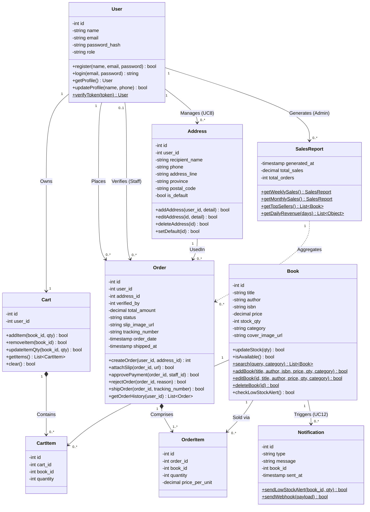
```mermaid
classDiagram
    %% Core Entities (Master Data)
    class User {
        -int id
        -string name
        -string email
        -string password_hash
        -string role
        +register(name, email, password) bool
        +login(email, password) string
        +getProfile() User
        +updateProfile(name, phone) bool
        +verifyToken(token) User$
    }

    class Address {
        -int id
        -int user_id
        -string recipient_name
        -string phone
        -string address_line
        -string province
        -string postal_code
        -bool is_default
        +addAddress(user_id, detail) bool
        +editAddress(id, detail) bool
        +deleteAddress(id) bool
        +setDefault(id) bool
    }

    class Book {
        -int id
        -string title
        -string author
        -string isbn
        -decimal price
        -int stock_qty
        -string category
        -string cover_image_url
        +updateStock(qty) bool
        +isAvailable() bool
        +search(query, category) List~Book~$
        +addBook(title, author, isbn, price, qty, category) bool$
        +editBook(id, title, author, price, qty, category) bool$
        +deleteBook(id) bool$
        +checkLowStockAlert() bool
    }

    class Notification {
        -int id
        -string type
        -string message
        -int book_id
        -timestamp sent_at
        +sendLowStockAlert(book_id, qty) bool$
        +sendWebhook(payload) bool$
    }

    class SalesReport {
        -timestamp generated_at
        -decimal total_sales
        -int total_orders
        +getWeeklySales() SalesReport$
        +getMonthlySales() SalesReport$
        +getTopSellers() List~Book~$
        +getDailyRevenue(days) List~Object~$
    }

    %% Transactional Entities (Operations)
    class Cart {
        -int id
        -int user_id
        +addItem(book_id, qty) bool
        +removeItem(book_id) bool
        +updateItemQty(book_id, qty) bool
        +getItems() List~CartItem~
        +clear() bool
    }

    class Order {
        -int id
        -int user_id
        -int address_id
        -int verified_by
        -decimal total_amount
        -string status
        -string slip_image_url
        -string tracking_number
        -timestamp order_date
        -timestamp shipped_at
        +createOrder(user_id, address_id) int
        +attachSlip(order_id, url) bool
        +approvePayment(order_id, staff_id) bool
        +rejectOrder(order_id, reason) bool
        +shipOrder(order_id, tracking_number) bool
        +getOrderHistory(user_id) List~Order~
    }

    %% Detail Entities (Sub-transactions)
    class CartItem {
        -int id
        -int cart_id
        -int book_id
        -int quantity
    }

    class OrderItem {
        -int id
        -int order_id
        -int book_id
        -int quantity
        -decimal price_per_unit
    }

    %% Relations
    User "1" --> "1" Cart : Owns
    User "1" --> "0..*" Order : Places
    User "1" --> "0..*" Address : Manages (UC8)
    User "0..1" --> "0..*" Order : Verifies (Staff)
    User "1" --> "0..*" SalesReport : Generates (Admin)

    Address "1" --> "0..*" Order : UsedIn

    Cart "1" *--> "0..*" CartItem : Contains
    Book "1" --> "0..*" CartItem : Referenced

    Order "1" *--> "1..*" OrderItem : Comprises
    Book "1" --> "0..*" OrderItem : Sold via

    Book "1" --> "0..*" Notification : Triggers (UC12)
    SalesReport "1" ..> "0..*" Order : Aggregates
```

---

## 🔄 3. Sequence Diagrams (ลำดับขั้นตอนการทำงานของระบบ)

แผนภาพแสดงลำดับการสื่อสารระหว่างผู้ใช้งาน หน้าเว็บ และระบบหลังบ้าน ตั้งแต่ต้นจนจบในแต่ละสถานการณ์สำคัญ:

> **คำอธิบายสัญลักษณ์ที่ใช้ในแผนภาพ**
> - **ลูกค้า / พนักงาน / แอดมิน** → ผู้ใช้งานระบบในแต่ละบทบาท
> - **หน้าเว็บ** → สิ่งที่ผู้ใช้เห็นและโต้ตอบในเบราว์เซอร์
> - **ระบบตรวจสอบสิทธิ์** → ด่านตรวจความปลอดภัยก่อนเข้าใช้ฟังก์ชันที่ต้องล็อกอิน
> - **ระบบหลังบ้าน** → ส่วนประมวลผลกฎเกณฑ์ทางธุรกิจและตรรกะของระบบ
> - **ฐานข้อมูล** → คลังเก็บข้อมูลส่วนกลางของร้าน (หนังสือ, ออเดอร์, สมาชิก)
> - `→` ลูกศรทึบ = ส่งคำขอ / ดำเนินการ
> - `-->` ลูกศรประ = ส่งผลลัพธ์กลับ

---

### 🔐 3.1 UC1 & UC2: การสมัครสมาชิกและการเข้าสู่ระบบ
แสดงขั้นตอนตั้งแต่ **กรอกข้อมูลสมัครสมาชิก** จนถึง **เข้าสู่ระบบสำเร็จ** และได้รับสิทธิ์ใช้งานตามบทบาท:

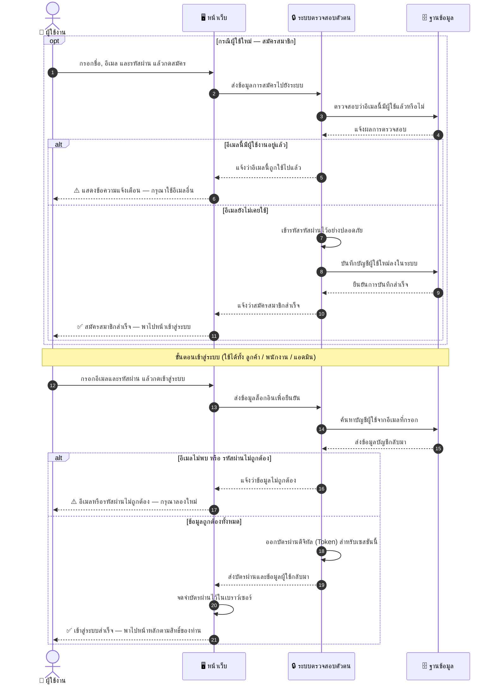
```mermaid
sequenceDiagram
    autonumber
    actor User as 👤 ผู้ใช้งาน
    participant Web as 🖥️ หน้าเว็บ
    participant Auth as 🔒 ระบบตรวจสอบตัวตน
    participant DB as 🗄️ ฐานข้อมูล

    opt กรณีผู้ใช้ใหม่ — สมัครสมาชิก
        User->>Web: กรอกชื่อ, อีเมล และรหัสผ่าน แล้วกดสมัคร
        Web->>Auth: ส่งข้อมูลการสมัครไปยังระบบ
        Auth->>DB: ตรวจสอบว่าอีเมลนี้มีผู้ใช้แล้วหรือไม่
        DB-->>Auth: แจ้งผลการตรวจสอบ
        alt อีเมลนี้มีผู้ใช้งานอยู่แล้ว
            Auth-->>Web: แจ้งว่าอีเมลนี้ถูกใช้ไปแล้ว
            Web-->>User: ⚠️ แสดงข้อความแจ้งเตือน — กรุณาใช้อีเมลอื่น
        else อีเมลยังไม่เคยใช้
            Auth->>Auth: เข้ารหัสรหัสผ่านไว้อย่างปลอดภัย
            Auth->>DB: บันทึกบัญชีผู้ใช้ใหม่ลงในระบบ
            DB-->>Auth: ยืนยันการบันทึกสำเร็จ
            Auth-->>Web: แจ้งว่าสมัครสมาชิกสำเร็จ
            Web-->>User: ✅ สมัครสมาชิกสำเร็จ — พาไปหน้าเข้าสู่ระบบ
        end
    end

    Note over User, DB: ขั้นตอนเข้าสู่ระบบ (ใช้ได้ทั้ง ลูกค้า / พนักงาน / แอดมิน)
    User->>Web: กรอกอีเมลและรหัสผ่าน แล้วกดเข้าสู่ระบบ
    Web->>Auth: ส่งข้อมูลล็อกอินเพื่อยืนยัน
    Auth->>DB: ค้นหาบัญชีผู้ใช้จากอีเมลที่กรอก
    DB-->>Auth: ส่งข้อมูลบัญชีกลับมา
    alt อีเมลไม่พบ หรือ รหัสผ่านไม่ถูกต้อง
        Auth-->>Web: แจ้งว่าข้อมูลไม่ถูกต้อง
        Web-->>User: ⚠️ อีเมลหรือรหัสผ่านไม่ถูกต้อง — กรุณาลองใหม่
    else ข้อมูลถูกต้องทั้งหมด
        Auth->>Auth: ออกบัตรผ่านดิจิทัล (Token) สำหรับเซสชันนี้
        Auth-->>Web: ส่งบัตรผ่านและข้อมูลผู้ใช้กลับมา
        Web->>Web: จดจำบัตรผ่านไว้ในเบราว์เซอร์
        Web-->>User: ✅ เข้าสู่ระบบสำเร็จ — พาไปหน้าหลักตามสิทธิ์ของท่าน
    end
```

### 👤 3.2 UC3: การแก้ไขโปรไฟล์และที่อยู่จัดส่ง
แสดงขั้นตอนที่ลูกค้า **เปิดดูข้อมูลส่วนตัว** แก้ไขชื่อ/เบอร์โทร และ **บันทึกที่อยู่จัดส่งใหม่**:

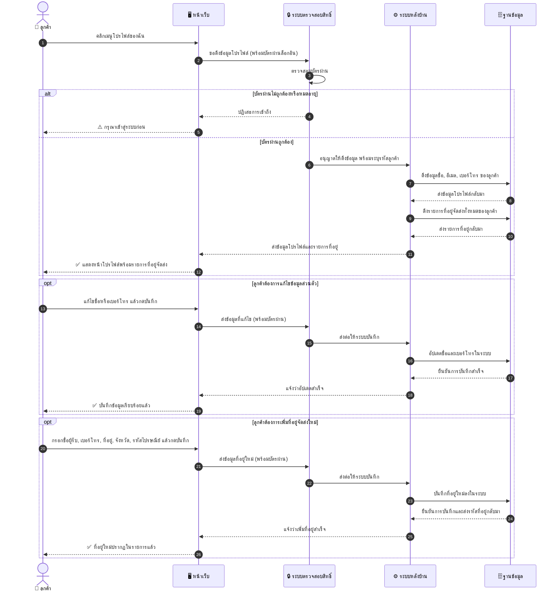
```mermaid
sequenceDiagram
    autonumber
    actor Customer as 👤 ลูกค้า
    participant Web as 🖥️ หน้าเว็บ
    participant Guard as 🔒 ระบบตรวจสอบสิทธิ์
    participant App as ⚙️ ระบบหลังบ้าน
    participant DB as 🗄️ ฐานข้อมูล

    Customer->>Web: คลิกเมนูโปรไฟล์ของฉัน
    Web->>Guard: ขอดึงข้อมูลโปรไฟล์ (พร้อมบัตรผ่านล็อกอิน)
    Guard->>Guard: ตรวจสอบบัตรผ่าน
    alt บัตรผ่านไม่ถูกต้องหรือหมดอายุ
        Guard-->>Web: ปฏิเสธการเข้าถึง
        Web-->>Customer: ⚠️ กรุณาเข้าสู่ระบบก่อน
    else บัตรผ่านถูกต้อง
        Guard->>App: อนุญาตให้ดึงข้อมูล พร้อมระบุรหัสลูกค้า
        App->>DB: ดึงข้อมูลชื่อ, อีเมล, เบอร์โทร ของลูกค้า
        DB-->>App: ส่งข้อมูลโปรไฟล์กลับมา
        App->>DB: ดึงรายการที่อยู่จัดส่งทั้งหมดของลูกค้า
        DB-->>App: ส่งรายการที่อยู่กลับมา
        App-->>Web: ส่งข้อมูลโปรไฟล์และรายการที่อยู่
        Web-->>Customer: ✅ แสดงหน้าโปรไฟล์พร้อมรายการที่อยู่จัดส่ง
    end

    opt ลูกค้าต้องการแก้ไขข้อมูลส่วนตัว
        Customer->>Web: แก้ไขชื่อหรือเบอร์โทร แล้วกดบันทึก
        Web->>Guard: ส่งข้อมูลที่แก้ไข (พร้อมบัตรผ่าน)
        Guard->>App: ส่งต่อให้ระบบบันทึก
        App->>DB: อัปเดตชื่อและเบอร์โทรในระบบ
        DB-->>App: ยืนยันการบันทึกสำเร็จ
        App-->>Web: แจ้งว่าอัปเดตสำเร็จ
        Web-->>Customer: ✅ บันทึกข้อมูลเรียบร้อยแล้ว
    end

    opt ลูกค้าต้องการเพิ่มที่อยู่จัดส่งใหม่
        Customer->>Web: กรอกชื่อผู้รับ, เบอร์โทร, ที่อยู่, จังหวัด, รหัสไปรษณีย์ แล้วกดบันทึก
        Web->>Guard: ส่งข้อมูลที่อยู่ใหม่ (พร้อมบัตรผ่าน)
        Guard->>App: ส่งต่อให้ระบบบันทึก
        App->>DB: บันทึกที่อยู่ใหม่ลงในระบบ
        DB-->>App: ยืนยันการบันทึกและส่งรหัสที่อยู่กลับมา
        App-->>Web: แจ้งว่าเพิ่มที่อยู่สำเร็จ
        Web-->>Customer: ✅ ที่อยู่ใหม่ปรากฏในรายการแล้ว
    end
```

### 🛒 3.3 UC4 & UC5: การค้นหาหนังสือและจัดการตะกร้าสินค้า
แสดงขั้นตอนตั้งแต่ **ค้นหาหนังสือ** ดูรายละเอียด ไปจนถึง **เพิ่มหรือลบสินค้าในตะกร้า** พร้อมตรวจสอบจำนวนสต็อกคงเหลือ:

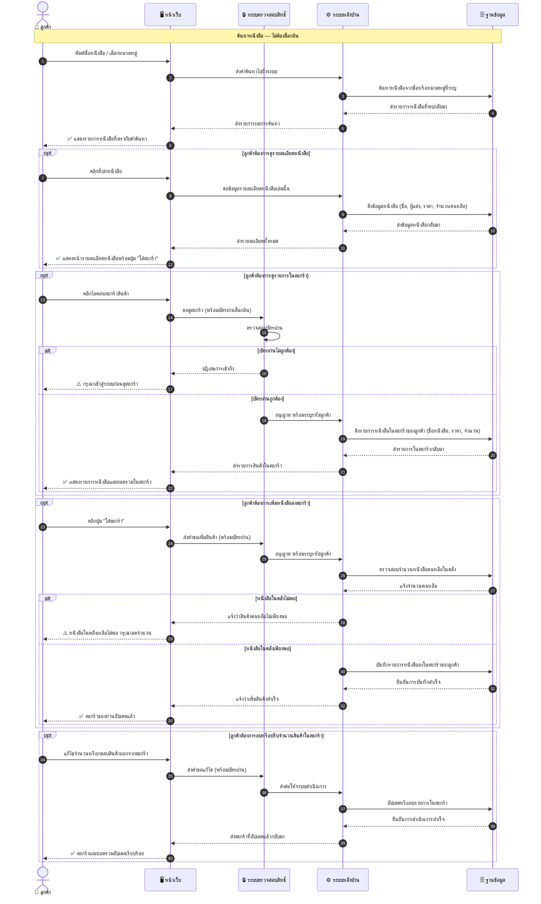
```mermaid
sequenceDiagram
    autonumber
    actor Customer as 👤 ลูกค้า
    participant Web as 🖥️ หน้าเว็บ
    participant Guard as 🔒 ระบบตรวจสอบสิทธิ์
    participant App as ⚙️ ระบบหลังบ้าน
    participant DB as 🗄️ ฐานข้อมูล

    Note over Customer, DB: ค้นหาหนังสือ — ไม่ต้องล็อกอิน
    Customer->>Web: พิมพ์ชื่อหนังสือ / เลือกหมวดหมู่
    Web->>App: ส่งคำค้นหาไปยังระบบ
    App->>DB: ค้นหาหนังสือจากชื่อหรือหมวดหมู่ที่ระบุ
    DB-->>App: ส่งรายการหนังสือที่พบกลับมา
    App-->>Web: ส่งรายการผลการค้นหา
    Web-->>Customer: ✅ แสดงรายการหนังสือที่ตรงกับคำค้นหา

    opt ลูกค้าต้องการดูรายละเอียดหนังสือ
        Customer->>Web: คลิกที่ปกหนังสือ
        Web->>App: ขอข้อมูลรายละเอียดหนังสือเล่มนั้น
        App->>DB: ดึงข้อมูลหนังสือ (ชื่อ, ผู้แต่ง, ราคา, จำนวนคงเหลือ)
        DB-->>App: ส่งข้อมูลหนังสือกลับมา
        App-->>Web: ส่งรายละเอียดทั้งหมด
        Web-->>Customer: ✅ แสดงหน้ารายละเอียดหนังสือพร้อมปุ่ม "ใส่ตะกร้า"
    end

    opt ลูกค้าต้องการดูรายการในตะกร้า
        Customer->>Web: คลิกไอคอนตะกร้าสินค้า
        Web->>Guard: ขอดูตะกร้า (พร้อมบัตรผ่านล็อกอิน)
        Guard->>Guard: ตรวจสอบบัตรผ่าน
        alt บัตรผ่านไม่ถูกต้อง
            Guard-->>Web: ปฏิเสธการเข้าถึง
            Web-->>Customer: ⚠️ กรุณาเข้าสู่ระบบก่อนดูตะกร้า
        else บัตรผ่านถูกต้อง
            Guard->>App: อนุญาต พร้อมระบุรหัสลูกค้า
            App->>DB: ดึงรายการหนังสือในตะกร้าของลูกค้า (ชื่อหนังสือ, ราคา, จำนวน)
            DB-->>App: ส่งรายการในตะกร้ากลับมา
            App-->>Web: ส่งรายการสินค้าในตะกร้า
            Web-->>Customer: ✅ แสดงรายการหนังสือและยอดรวมในตะกร้า
        end
    end

    opt ลูกค้าต้องการเพิ่มหนังสือลงตะกร้า
        Customer->>Web: คลิกปุ่ม "ใส่ตะกร้า"
        Web->>Guard: ส่งคำขอเพิ่มสินค้า (พร้อมบัตรผ่าน)
        Guard->>App: อนุญาต พร้อมระบุรหัสลูกค้า
        App->>DB: ตรวจสอบจำนวนหนังสือคงเหลือในคลัง
        DB-->>App: แจ้งจำนวนคงเหลือ
        alt หนังสือในคลังไม่พอ
            App-->>Web: แจ้งว่าสินค้าคงเหลือไม่เพียงพอ
            Web-->>Customer: ⚠️ หนังสือในคลังเหลือไม่พอ กรุณาลดจำนวน
        else หนังสือในคลังเพียงพอ
            App->>DB: บันทึกรายการหนังสือลงในตะกร้าของลูกค้า
            DB-->>App: ยืนยันการบันทึกสำเร็จ
            App-->>Web: แจ้งว่าเพิ่มสินค้าสำเร็จ
            Web-->>Customer: ✅ ตะกร้าของท่านอัปเดตแล้ว
        end
    end

    opt ลูกค้าต้องการลบหรือปรับจำนวนสินค้าในตะกร้า
        Customer->>Web: แก้ไขจำนวนหรือกดลบสินค้าออกจากตะกร้า
        Web->>Guard: ส่งคำขอแก้ไข (พร้อมบัตรผ่าน)
        Guard->>App: ส่งต่อให้ระบบดำเนินการ
        App->>DB: อัปเดตหรือลบรายการในตะกร้า
        DB-->>App: ยืนยันการดำเนินการสำเร็จ
        App-->>Web: ส่งตะกร้าที่อัปเดตแล้วกลับมา
        Web-->>Customer: ✅ ตะกร้าและยอดรวมอัปเดตเรียบร้อย
    end
```

### 💳 3.4 UC6: การยืนยันสั่งซื้อหนังสือ (Checkout Flow)
แสดงขั้นตอน **กดยืนยันสั่งซื้อ** ที่ระบบจะตรวจสอบและจองจำนวนสินค้าพร้อมกันเพื่อป้องกันการสั่งเกินสต็อก:

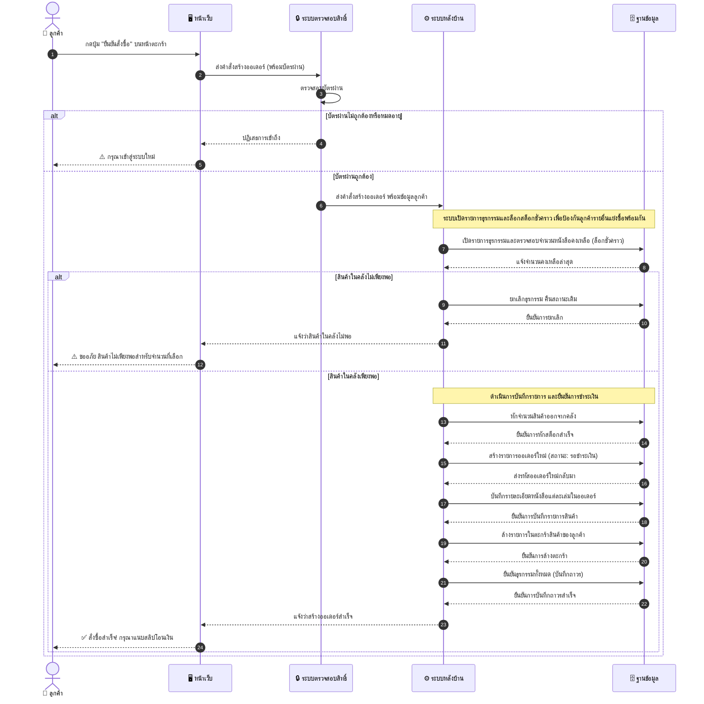
```mermaid
sequenceDiagram
    autonumber
    actor Customer as 👤 ลูกค้า
    participant Web as 🖥️ หน้าเว็บ
    participant Guard as 🔒 ระบบตรวจสอบสิทธิ์
    participant App as ⚙️ ระบบหลังบ้าน
    participant DB as 🗄️ ฐานข้อมูล

    Customer->>Web: กดปุ่ม "ยืนยันสั่งซื้อ" บนหน้าตะกร้า
    Web->>Guard: ส่งคำสั่งสร้างออเดอร์ (พร้อมบัตรผ่าน)
    Guard->>Guard: ตรวจสอบบัตรผ่าน
    alt บัตรผ่านไม่ถูกต้องหรือหมดอายุ
        Guard-->>Web: ปฏิเสธการเข้าถึง
        Web-->>Customer: ⚠️ กรุณาเข้าสู่ระบบใหม่
    else บัตรผ่านถูกต้อง
        Guard->>App: ส่งคำสั่งสร้างออเดอร์ พร้อมข้อมูลลูกค้า
        Note over App, DB: ระบบเปิดรายการธุรกรรมและล็อกสต็อกชั่วคราว เพื่อป้องกันลูกค้ารายอื่นแย่งซื้อพร้อมกัน
        App->>DB: เปิดรายการธุรกรรมและตรวจสอบจำนวนหนังสือคงเหลือ (ล็อกชั่วคราว)
        DB-->>App: แจ้งจำนวนคงเหลือล่าสุด
        alt สินค้าในคลังไม่เพียงพอ
            App->>DB: ยกเลิกธุรกรรม คืนสถานะเดิม
            DB-->>App: ยืนยันการยกเลิก
            App-->>Web: แจ้งว่าสินค้าในคลังไม่พอ
            Web-->>Customer: ⚠️ ขออภัย สินค้าไม่เพียงพอสำหรับจำนวนที่เลือก
        else สินค้าในคลังเพียงพอ
            Note over App, DB: ดำเนินการบันทึกรายการ และยืนยันการชำระเงิน
            App->>DB: หักจำนวนสินค้าออกจากคลัง
            DB-->>App: ยืนยันการหักสต็อกสำเร็จ
            App->>DB: สร้างรายการออเดอร์ใหม่ (สถานะ: รอชำระเงิน)
            DB-->>App: ส่งรหัสออเดอร์ใหม่กลับมา
            App->>DB: บันทึกรายละเอียดหนังสือแต่ละเล่มในออเดอร์
            DB-->>App: ยืนยันการบันทึกรายการสินค้า
            App->>DB: ล้างรายการในตะกร้าสินค้าของลูกค้า
            DB-->>App: ยืนยันการล้างตะกร้า
            App->>DB: ยืนยันธุรกรรมทั้งหมด (บันทึกถาวร)
            DB-->>App: ยืนยันการบันทึกถาวรสำเร็จ
            App-->>Web: แจ้งว่าสร้างออเดอร์สำเร็จ
            Web-->>Customer: ✅ สั่งซื้อสำเร็จ! กรุณาแนบสลิปโอนเงิน
        end
    end
```

### 📄 3.5 UC7: การแนบหลักฐานการชำระเงิน
แสดงขั้นตอนที่ลูกค้า **อัปโหลดรูปภาพสลิปโอนเงิน** เพื่อผูกกับรายการสั่งซื้อที่รอชำระ:

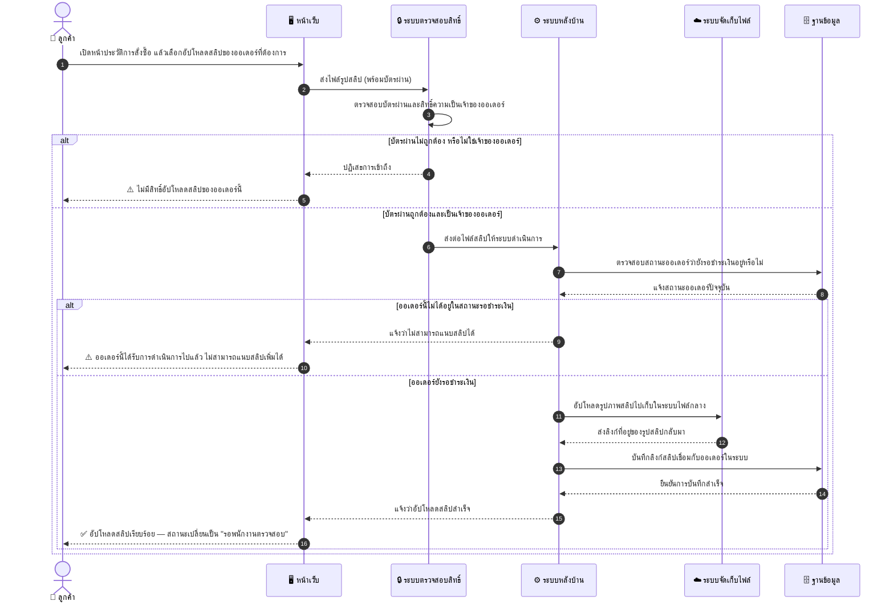
```mermaid
sequenceDiagram
    autonumber
    actor Customer as 👤 ลูกค้า
    participant Web as 🖥️ หน้าเว็บ
    participant Guard as 🔒 ระบบตรวจสอบสิทธิ์
    participant App as ⚙️ ระบบหลังบ้าน
    participant Storage as ☁️ ระบบจัดเก็บไฟล์
    participant DB as 🗄️ ฐานข้อมูล

    Customer->>Web: เปิดหน้าประวัติการสั่งซื้อ แล้วเลือกอัปโหลดสลิปของออเดอร์ที่ต้องการ
    Web->>Guard: ส่งไฟล์รูปสลิป (พร้อมบัตรผ่าน)
    Guard->>Guard: ตรวจสอบบัตรผ่านและสิทธิ์ความเป็นเจ้าของออเดอร์
    alt บัตรผ่านไม่ถูกต้อง หรือไม่ใช่เจ้าของออเดอร์
        Guard-->>Web: ปฏิเสธการเข้าถึง
        Web-->>Customer: ⚠️ ไม่มีสิทธิ์อัปโหลดสลิปของออเดอร์นี้
    else บัตรผ่านถูกต้องและเป็นเจ้าของออเดอร์
        Guard->>App: ส่งต่อไฟล์สลิปให้ระบบดำเนินการ
        App->>DB: ตรวจสอบสถานะออเดอร์ว่ายังรอชำระเงินอยู่หรือไม่
        DB-->>App: แจ้งสถานะออเดอร์ปัจจุบัน
        alt ออเดอร์นี้ไม่ได้อยู่ในสถานะรอชำระเงิน
            App-->>Web: แจ้งว่าไม่สามารถแนบสลิปได้
            Web-->>Customer: ⚠️ ออเดอร์นี้ได้รับการดำเนินการไปแล้ว ไม่สามารถแนบสลิปเพิ่มได้
        else ออเดอร์ยังรอชำระเงิน
            App->>Storage: อัปโหลดรูปภาพสลิปไปเก็บในระบบไฟล์กลาง
            Storage-->>App: ส่งลิงก์ที่อยู่ของรูปสลิปกลับมา
            App->>DB: บันทึกลิงก์สลิปเชื่อมกับออเดอร์ในระบบ
            DB-->>App: ยืนยันการบันทึกสำเร็จ
            App-->>Web: แจ้งว่าอัปโหลดสลิปสำเร็จ
            Web-->>Customer: ✅ อัปโหลดสลิปเรียบร้อย — สถานะเปลี่ยนเป็น "รอพนักงานตรวจสอบ"
        end
    end
```

### 📦 3.6 UC8: ติดตามพัสดุและประวัติออเดอร์
แสดงขั้นตอนที่ลูกค้า **ดูรายการออเดอร์ทั้งหมด** สถานะ และ **เลขติดตามพัสดุ**:

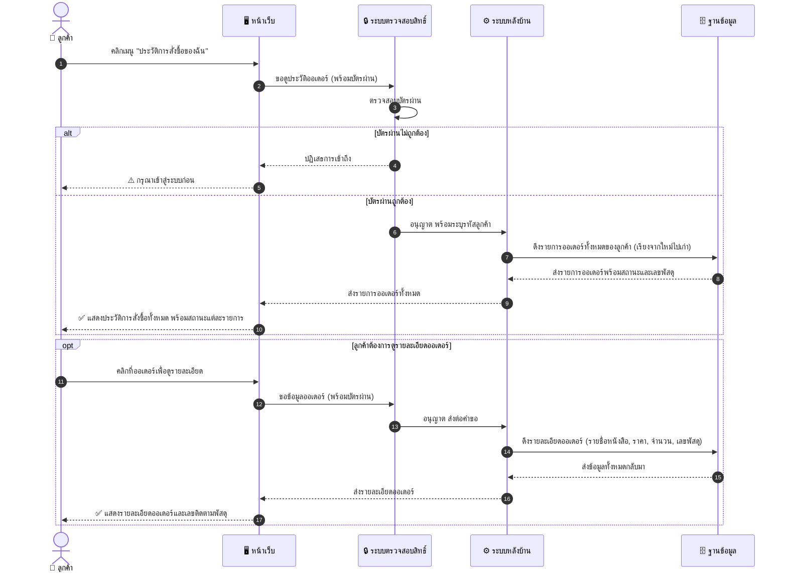
```mermaid
sequenceDiagram
    autonumber
    actor Customer as 👤 ลูกค้า
    participant Web as 🖥️ หน้าเว็บ
    participant Guard as 🔒 ระบบตรวจสอบสิทธิ์
    participant App as ⚙️ ระบบหลังบ้าน
    participant DB as 🗄️ ฐานข้อมูล

    Customer->>Web: คลิกเมนู "ประวัติการสั่งซื้อของฉัน"
    Web->>Guard: ขอดูประวัติออเดอร์ (พร้อมบัตรผ่าน)
    Guard->>Guard: ตรวจสอบบัตรผ่าน
    alt บัตรผ่านไม่ถูกต้อง
        Guard-->>Web: ปฏิเสธการเข้าถึง
        Web-->>Customer: ⚠️ กรุณาเข้าสู่ระบบก่อน
    else บัตรผ่านถูกต้อง
        Guard->>App: อนุญาต พร้อมระบุรหัสลูกค้า
        App->>DB: ดึงรายการออเดอร์ทั้งหมดของลูกค้า (เรียงจากใหม่ไปเก่า)
        DB-->>App: ส่งรายการออเดอร์พร้อมสถานะและเลขพัสดุ
        App-->>Web: ส่งรายการออเดอร์ทั้งหมด
        Web-->>Customer: ✅ แสดงประวัติการสั่งซื้อทั้งหมด พร้อมสถานะแต่ละรายการ
    end

    opt ลูกค้าต้องการดูรายละเอียดออเดอร์
        Customer->>Web: คลิกที่ออเดอร์เพื่อดูรายละเอียด
        Web->>Guard: ขอข้อมูลออเดอร์ (พร้อมบัตรผ่าน)
        Guard->>App: อนุญาต ส่งต่อคำขอ
        App->>DB: ดึงรายละเอียดออเดอร์ (รายชื่อหนังสือ, ราคา, จำนวน, เลขพัสดุ)
        DB-->>App: ส่งข้อมูลทั้งหมดกลับมา
        App-->>Web: ส่งรายละเอียดออเดอร์
        Web-->>Customer: ✅ แสดงรายละเอียดออเดอร์และเลขติดตามพัสดุ
    end
```

### 📦 3.7 UC9 & UC10: การตรวจสอบสลิปและการบันทึกจัดส่ง
แสดงขั้นตอนที่พนักงาน **ตรวจสอบและอนุมัติสลิปโอนเงิน** และ **บันทึกเลขพัสดุ** เพื่อส่งสินค้าให้ลูกค้า:

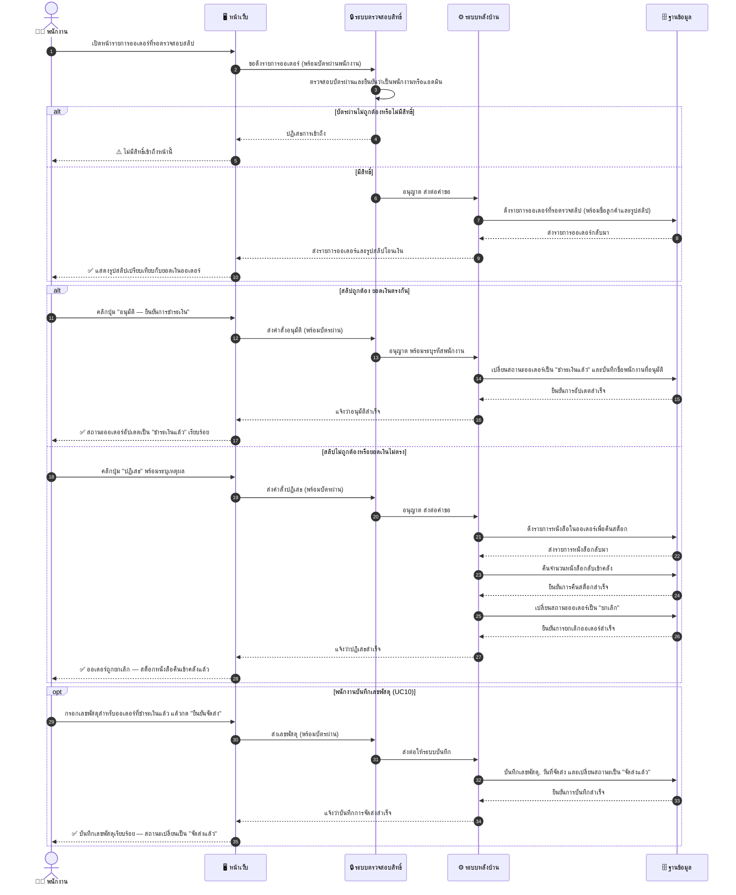
```mermaid
sequenceDiagram
    autonumber
    actor Staff as 🧑‍💼 พนักงาน
    participant Web as 🖥️ หน้าเว็บ
    participant Guard as 🔒 ระบบตรวจสอบสิทธิ์
    participant App as ⚙️ ระบบหลังบ้าน
    participant DB as 🗄️ ฐานข้อมูล

    Staff->>Web: เปิดหน้ารายการออเดอร์ที่รอตรวจสอบสลิป
    Web->>Guard: ขอดึงรายการออเดอร์ (พร้อมบัตรผ่านพนักงาน)
    Guard->>Guard: ตรวจสอบบัตรผ่านและยืนยันว่าเป็นพนักงานหรือแอดมิน
    alt บัตรผ่านไม่ถูกต้องหรือไม่มีสิทธิ์
        Guard-->>Web: ปฏิเสธการเข้าถึง
        Web-->>Staff: ⚠️ ไม่มีสิทธิ์เข้าถึงหน้านี้
    else มีสิทธิ์
        Guard->>App: อนุญาต ส่งต่อคำขอ
        App->>DB: ดึงรายการออเดอร์ที่รอตรวจสลิป (พร้อมชื่อลูกค้าและรูปสลิป)
        DB-->>App: ส่งรายการออเดอร์กลับมา
        App-->>Web: ส่งรายการออเดอร์และรูปสลิปโอนเงิน
        Web-->>Staff: ✅ แสดงรูปสลิปเปรียบเทียบกับยอดเงินออเดอร์
    end

    alt สลิปถูกต้อง ยอดเงินตรงกัน
        Staff->>Web: คลิกปุ่ม "อนุมัติ — ยืนยันการชำระเงิน"
        Web->>Guard: ส่งคำสั่งอนุมัติ (พร้อมบัตรผ่าน)
        Guard->>App: อนุญาต พร้อมระบุรหัสพนักงาน
        App->>DB: เปลี่ยนสถานะออเดอร์เป็น "ชำระเงินแล้ว" และบันทึกชื่อพนักงานที่อนุมัติ
        DB-->>App: ยืนยันการอัปเดตสำเร็จ
        App-->>Web: แจ้งว่าอนุมัติสำเร็จ
        Web-->>Staff: ✅ สถานะออเดอร์อัปเดตเป็น "ชำระเงินแล้ว" เรียบร้อย
    else สลิปไม่ถูกต้องหรือยอดเงินไม่ตรง
        Staff->>Web: คลิกปุ่ม "ปฏิเสธ" พร้อมระบุเหตุผล
        Web->>Guard: ส่งคำสั่งปฏิเสธ (พร้อมบัตรผ่าน)
        Guard->>App: อนุญาต ส่งต่อคำขอ
        App->>DB: ดึงรายการหนังสือในออเดอร์เพื่อคืนสต็อก
        DB-->>App: ส่งรายการหนังสือกลับมา
        App->>DB: คืนจำนวนหนังสือกลับเข้าคลัง
        DB-->>App: ยืนยันการคืนสต็อกสำเร็จ
        App->>DB: เปลี่ยนสถานะออเดอร์เป็น "ยกเลิก"
        DB-->>App: ยืนยันการยกเลิกออเดอร์สำเร็จ
        App-->>Web: แจ้งว่าปฏิเสธสำเร็จ
        Web-->>Staff: ✅ ออเดอร์ถูกยกเลิก — สต็อกหนังสือคืนเข้าคลังแล้ว
    end

    opt พนักงานบันทึกเลขพัสดุ (UC10)
        Staff->>Web: กรอกเลขพัสดุสำหรับออเดอร์ที่ชำระเงินแล้ว แล้วกด "ยืนยันจัดส่ง"
        Web->>Guard: ส่งเลขพัสดุ (พร้อมบัตรผ่าน)
        Guard->>App: ส่งต่อให้ระบบบันทึก
        App->>DB: บันทึกเลขพัสดุ, วันที่จัดส่ง และเปลี่ยนสถานะเป็น "จัดส่งแล้ว"
        DB-->>App: ยืนยันการบันทึกสำเร็จ
        App-->>Web: แจ้งว่าบันทึกการจัดส่งสำเร็จ
        Web-->>Staff: ✅ บันทึกเลขพัสดุเรียบร้อย — สถานะเปลี่ยนเป็น "จัดส่งแล้ว"
    end
```

### ⚙️ 3.8 UC11 & UC12: การบริหารคลังสินค้าและแจ้งเตือนสต็อกต่ำ
แสดงขั้นตอนที่พนักงาน/แอดมิน **เพิ่ม แก้ไข หรือลบหนังสือ** ในคลัง และระบบ **แจ้งเตือนอัตโนมัติ** เมื่อสินค้าใกล้หมด:

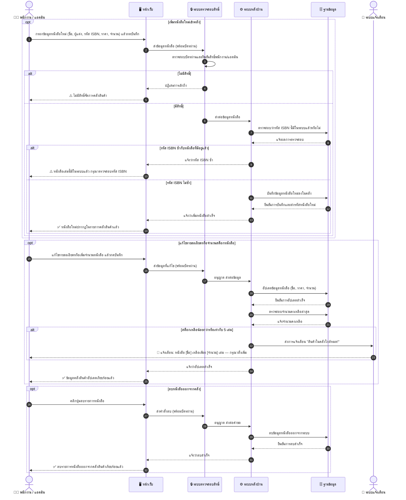
```mermaid
sequenceDiagram
    autonumber
    actor Staff as 🧑‍💼 พนักงาน / แอดมิน
    participant Web as 🖥️ หน้าเว็บ
    participant Guard as 🔒 ระบบตรวจสอบสิทธิ์
    participant App as ⚙️ ระบบหลังบ้าน
    participant DB as 🗄️ ฐานข้อมูล
    actor Notify as 🔔 ระบบแจ้งเตือน

    opt เพิ่มหนังสือใหม่เข้าคลัง
        Staff->>Web: กรอกข้อมูลหนังสือใหม่ (ชื่อ, ผู้แต่ง, รหัส ISBN, ราคา, จำนวน) แล้วกดบันทึก
        Web->>Guard: ส่งข้อมูลหนังสือ (พร้อมบัตรผ่าน)
        Guard->>Guard: ตรวจสอบบัตรผ่านและยืนยันสิทธิ์พนักงาน/แอดมิน
        alt ไม่มีสิทธิ์
            Guard-->>Web: ปฏิเสธการเข้าถึง
            Web-->>Staff: ⚠️ ไม่มีสิทธิ์จัดการคลังสินค้า
        else มีสิทธิ์
            Guard->>App: ส่งต่อข้อมูลหนังสือ
            App->>DB: ตรวจสอบว่ารหัส ISBN นี้มีในระบบแล้วหรือไม่
            DB-->>App: แจ้งผลการตรวจสอบ
            alt รหัส ISBN ซ้ำกับหนังสือที่มีอยู่แล้ว
                App-->>Web: แจ้งว่ารหัส ISBN ซ้ำ
                Web-->>Staff: ⚠️ หนังสือเล่มนี้มีในระบบแล้ว กรุณาตรวจสอบรหัส ISBN
            else รหัส ISBN ไม่ซ้ำ
                App->>DB: บันทึกข้อมูลหนังสือใหม่ลงในคลัง
                DB-->>App: ยืนยันการบันทึกและส่งรหัสหนังสือใหม่
                App-->>Web: แจ้งว่าเพิ่มหนังสือสำเร็จ
                Web-->>Staff: ✅ หนังสือใหม่ปรากฏในรายการคลังสินค้าแล้ว
            end
        end
    end

    opt แก้ไขรายละเอียดหรือจำนวนสต็อกหนังสือ
        Staff->>Web: แก้ไขรายละเอียดหรือเพิ่มจำนวนหนังสือ แล้วกดบันทึก
        Web->>Guard: ส่งข้อมูลที่แก้ไข (พร้อมบัตรผ่าน)
        Guard->>App: อนุญาต ส่งต่อข้อมูล
        App->>DB: อัปเดตข้อมูลหนังสือ (ชื่อ, ราคา, จำนวน)
        DB-->>App: ยืนยันการอัปเดตสำเร็จ
        App->>DB: ตรวจสอบจำนวนคงเหลือล่าสุด
        DB-->>App: แจ้งจำนวนคงเหลือ
        alt สต็อกเหลือน้อยกว่าหรือเท่ากับ 5 เล่ม
            App->>Notify: ส่งการแจ้งเตือน "สินค้าในคลังใกล้หมด!"
            Notify-->>Staff: 🔔 แจ้งเตือน: หนังสือ [ชื่อ] เหลือเพียง [จำนวน] เล่ม — กรุณาสั่งเพิ่ม
        end
        App-->>Web: แจ้งว่าอัปเดตสำเร็จ
        Web-->>Staff: ✅ ข้อมูลคลังสินค้าอัปเดตเรียบร้อยแล้ว
    end

    opt ลบหนังสือออกจากคลัง
        Staff->>Web: คลิกปุ่มลบรายการหนังสือ
        Web->>Guard: ส่งคำสั่งลบ (พร้อมบัตรผ่าน)
        Guard->>App: อนุญาต ส่งต่อคำขอ
        App->>DB: ลบข้อมูลหนังสือออกจากระบบ
        DB-->>App: ยืนยันการลบสำเร็จ
        App-->>Web: แจ้งว่าลบสำเร็จ
        Web-->>Staff: ✅ ลบรายการหนังสือออกจากคลังสินค้าเรียบร้อยแล้ว
    end
```

### 📊 3.9 UC13 & UC14: รายงานสรุปยอดขายและจัดการผู้ใช้สำหรับผู้ดูแลระบบ
แสดงขั้นตอนที่แอดมิน **เปิดดูแดชบอร์ดยอดขาย** และสถิติต่างๆ ที่ระบบดึงข้อมูลมาแสดงผล:

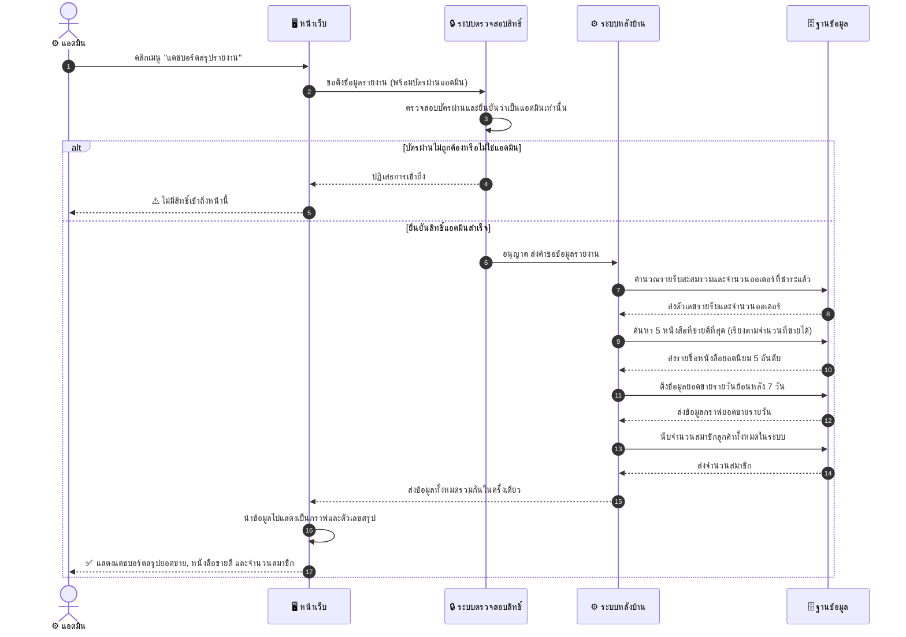
```mermaid
sequenceDiagram
    autonumber
    actor Admin as ⚙️ แอดมิน
    participant Web as 🖥️ หน้าเว็บ
    participant Guard as 🔒 ระบบตรวจสอบสิทธิ์
    participant App as ⚙️ ระบบหลังบ้าน
    participant DB as 🗄️ ฐานข้อมูล

    Admin->>Web: คลิกเมนู "แดชบอร์ดสรุปรายงาน"
    Web->>Guard: ขอดึงข้อมูลรายงาน (พร้อมบัตรผ่านแอดมิน)
    Guard->>Guard: ตรวจสอบบัตรผ่านและยืนยันว่าเป็นแอดมินเท่านั้น
    alt บัตรผ่านไม่ถูกต้องหรือไม่ใช่แอดมิน
        Guard-->>Web: ปฏิเสธการเข้าถึง
        Web-->>Admin: ⚠️ ไม่มีสิทธิ์เข้าถึงหน้านี้
    else ยืนยันสิทธิ์แอดมินสำเร็จ
        Guard->>App: อนุญาต ส่งคำขอข้อมูลรายงาน
        App->>DB: คำนวณรายรับสะสมรวมและจำนวนออเดอร์ที่ชำระแล้ว
        DB-->>App: ส่งตัวเลขรายรับและจำนวนออเดอร์
        App->>DB: ค้นหา 5 หนังสือที่ขายดีที่สุด (เรียงตามจำนวนที่ขายได้)
        DB-->>App: ส่งรายชื่อหนังสือยอดนิยม 5 อันดับ
        App->>DB: ดึงข้อมูลยอดขายรายวันย้อนหลัง 7 วัน
        DB-->>App: ส่งข้อมูลกราฟยอดขายรายวัน
        App->>DB: นับจำนวนสมาชิกลูกค้าทั้งหมดในระบบ
        DB-->>App: ส่งจำนวนสมาชิก
        App-->>Web: ส่งข้อมูลทั้งหมดรวมกันในครั้งเดียว
        Web->>Web: นำข้อมูลไปแสดงเป็นกราฟและตัวเลขสรุป
        Web-->>Admin: ✅ แสดงแดชบอร์ดสรุปยอดขาย, หนังสือขายดี และจำนวนสมาชิก
    end
```

---

## 🔄 4. Activity Diagram (แผนภาพแสดงลำดับเวิร์กโฟลว์ผู้ใช้ข้ามบทบาท)

แผนภาพกิจกรรม (Activity Diagram) แสดงการไหลของกระบวนการสั่งซื้อหนังสือข้ามระบบผู้ใช้แบบ Swimlanes:

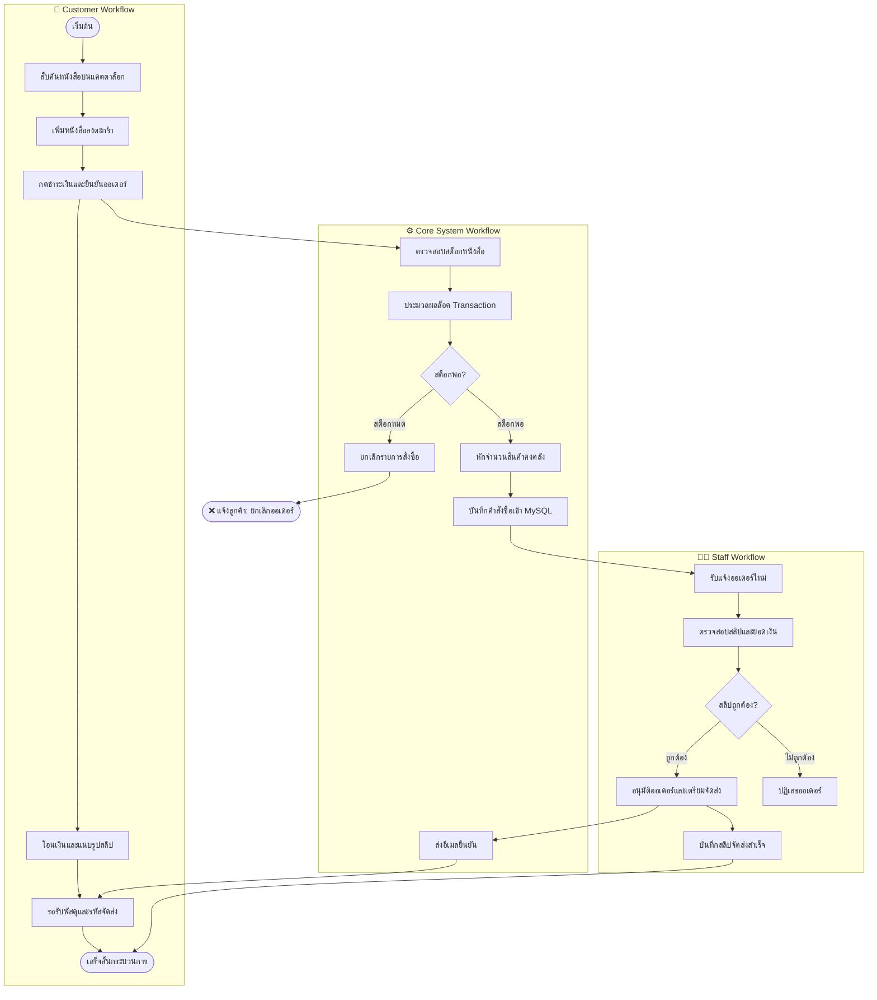
```mermaid
flowchart TD
    subgraph Customer_Lane ["👤 Customer Workflow"]
        A1([เริ่มต้น]) --> A2[สืบค้นหนังสือบนแคตตาล็อก]
        A2 --> A3[เพิ่มหนังสือลงตะกร้า]
        A3 --> A4[กดชำระเงินและยืนยันออเดอร์]
        A4 --> A5[โอนเงินและแนบรูปสลิป]
        A5 --> A6[รอรับพัสดุและรหัสจัดส่ง]
        A6 --> A7([เสร็จสิ้นกระบวนการ])
    end

    subgraph System_Lane ["⚙️ Core System Workflow"]
        S1[ตรวจสอบสต็อกหนังสือ]
        S2[ประมวลผลล็อค Transaction]
        S3{สต็อกพอ?}
        S4[หักจำนวนสินค้าคงคลัง]
        S5[บันทึกคำสั่งซื้อเข้า MySQL]
        S6[ยกเลิกรายการสั่งซื้อ]
        S7[ส่งอีเมลยืนยัน]
        S1 --> S2 --> S3
        S3 -->|สต็อกพอ| S4 --> S5
        S3 -->|สต็อกหมด| S6
    end

    subgraph Staff_Lane ["🧑‍💼 Staff Workflow"]
        ST1[รับแจ้งออเดอร์ใหม่]
        ST2[ตรวจสอบสลิปและยอดเงิน]
        ST3{สลิปถูกต้อง?}
        ST4[อนุมัติออเดอร์และเตรียมจัดส่ง]
        ST5[บันทึกสลิปจัดส่งสำเร็จ]
        ST6[ปฏิเสธออเดอร์]
        ST1 --> ST2 --> ST3
        ST3 -->|ถูกต้อง| ST4 --> ST5
        ST3 -->|ไม่ถูกต้อง| ST6
    end

    A4 --> S1
    S5 --> ST1
    S6 --> A_Cancel([❌ แจ้งลูกค้า: ยกเลิกออเดอร์])
    ST4 --> S7 --> A6
    ST5 --> A7
```

---

## 📌 5. State Diagram (วงจรชีวิตสถานะของคำสั่งซื้อ Order)

แผนภาพสถานะ (State Diagram) แสดงการเปลี่ยนสถานะของ Order ตลอด Lifecycle ตั้งแต่ลูกค้ากดยืนยัน จนพัสดุถูกจัดส่งหรือออเดอร์ถูกยกเลิก:

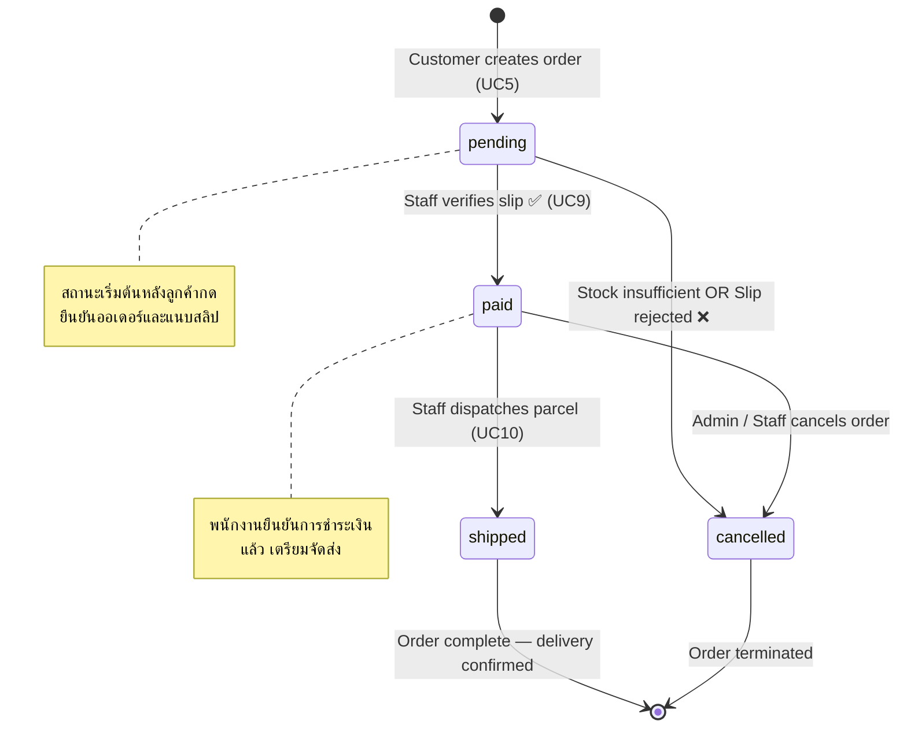
```mermaid
stateDiagram-v2
    [*] --> pending : Customer creates order (UC5)
    pending --> paid : Staff verifies slip ✅ (UC9)
    pending --> cancelled : Stock insufficient OR Slip rejected ❌
    paid --> shipped : Staff dispatches parcel (UC10)
    paid --> cancelled : Admin / Staff cancels order
    shipped --> [*] : Order complete — delivery confirmed
    cancelled --> [*] : Order terminated

    note right of pending
        สถานะเริ่มต้นหลังลูกค้ากด
        ยืนยันออเดอร์และแนบสลิป
    end note
    note right of paid
        พนักงานยืนยันการชำระเงิน
        แล้ว เตรียมจัดส่ง
    end note
```

---

## 💾 6. Database ERD (การออกแบบความสัมพันธ์ฐานข้อมูล MySQL 3NF)

แผนภาพความสัมพันธ์ของเอนทิตี (Entity-Relationship Diagram) แสดงรูปแบบฐานข้อมูลจริงที่รันในโปรดักชัน ซึ่งแยกส่วนของตารางกลางแบบ Normalized (3NF):

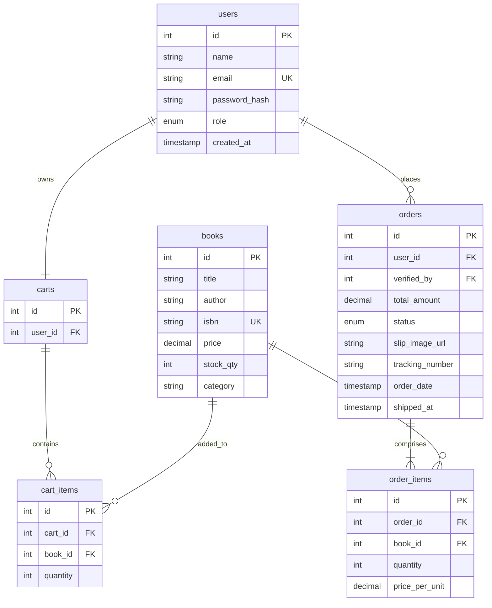
```mermaid
erDiagram
    users {
        int id PK
        string name
        string email UK
        string password_hash
        enum role
        timestamp created_at
    }
    books {
        int id PK
        string title
        string author
        string isbn UK
        decimal price
        int stock_qty
        string category
    }
    carts {
        int id PK
        int user_id FK
    }
    cart_items {
        int id PK
        int cart_id FK
        int book_id FK
        int quantity
    }
    orders {
        int id PK
        int user_id FK
        int verified_by FK
        decimal total_amount
        enum status
        string slip_image_url
        string tracking_number
        timestamp order_date
        timestamp shipped_at
    }
    order_items {
        int id PK
        int order_id FK
        int book_id FK
        int quantity
        decimal price_per_unit
    }

    users ||--|| carts : owns
    users ||--o{ orders : places
    carts ||--o{ cart_items : contains
    books ||--o{ cart_items : added_to
    orders ||--|{ order_items : comprises
    books ||--o{ order_items : sold_in
```

---

## 🚀 7. Deployment Architecture (สถาปัตยกรรมทางกายภาพและการติดตั้งจริง)

แผนภาพจำลองการติดตั้งระบบบน Cloud แยกสภาพแวดล้อมฝั่ง Client (React บน Vercel) และ Backend (Node.js & Express บน Render) เชื่อมสู่ MySQL:

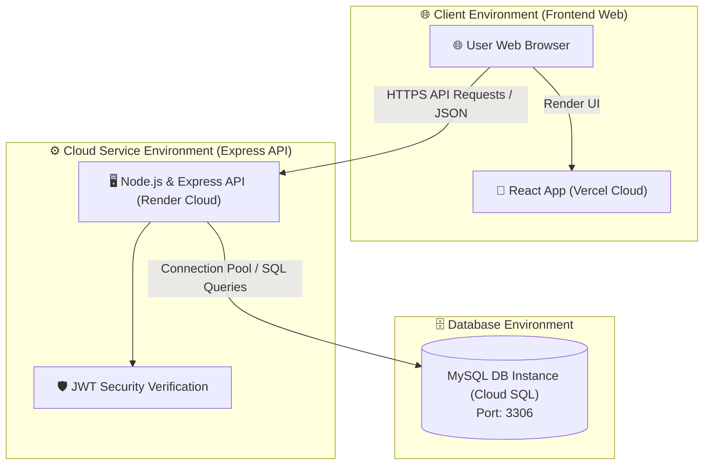
```mermaid
flowchart TD
    subgraph Client_Env ["🌐 Client Environment (Frontend Web)"]
        Browser["🌐 User Web Browser"]
        ReactApp["📱 React App (Vercel Cloud)"]
        Browser -->|Render UI| ReactApp
    end

    subgraph Cloud_Env ["⚙️ Cloud Service Environment (Express API)"]
        API_Server["🖥️ Node.js & Express API (Render Cloud)"]
        JWT_Verify["🛡️ JWT Security Verification"]
        API_Server --> JWT_Verify
    end

    subgraph Data_Env ["🗄️ Database Environment"]
        MySQL_RDS[("MySQL DB Instance (Cloud SQL)\nPort: 3306")]
    end

    Browser -->|HTTPS API Requests / JSON| API_Server
    API_Server -->|Connection Pool / SQL Queries| MySQL_RDS
```

---

## 💾 8. Data Schema Specification (JSON Contract Payload)

โครงสร้างข้อมูลระดับลึก (Data Contract Payload) ที่ใช้ทดสอบสัญญาความถูกต้องในการผูกระบบระหว่างหน้าบ้านและ API หลังบ้าน:

```json
{
  "transaction_metadata": {
    "environment": "production-v1",
    "api_version": "1.0.4"
  },
  "order_id": 40291,
  "customer_details": {
    "student_user_id": 67120669,
    "fullname": "Siradech Sriam",
    "shipping_address": "99/1 ถนนวิภาวดีรังสิต ดินแดง กรุงเทพฯ"
  },
  "items": [
    {
      "book_id": 101,
      "title": "คู่มือการพัฒนาซอฟต์แวร์แพลตฟอร์มด้วย React",
      "quantity": 2,
      "price_per_unit": 250.00
    },
    {
      "book_id": 105,
      "title": "Introduction to RDBMS & MySQL Architecture",
      "quantity": 1,
      "price_per_unit": 390.00
    }
  ],
  "financials": {
    "subtotal": 890.00,
    "shipping_fee": 0.00,
    "grand_total": 890.00
  },
  "payment_status": "Verified_Success",
  "is_dispatched": true
}
```

---

## 🚀 9. แหล่งเก็บซอร์สโค้ดและรายงานความคืบหน้า (Project Deliverables)

### 👥 โครงสร้างทีมและบทบาทหน้าที่

| รายชื่อสมาชิก | บทบาทหน้าที่ (Role) | ขอบเขตความรับผิดชอบหลัก |
| :--- | :--- | :--- |
| **นายศิระเดช ศรีอ่ำ** (67120669) | 🛂 Customer System Developer | ฟังก์ชันลูกค้าทั้งหมด (Storefront, ค้นหาหนังสือ, ตะกร้า, สั่งซื้อ/แนบสลิป) |
| **นายกิตติวัฒน์ กุดั่น** (67107666) | 🧑‍💼 Admin System Developer | ฟังก์ชันพนักงาน/แอดมิน (อนุมัติสลิปและจัดการจัดส่งสินค้า) |
| **นายศุภวิชญ์ เชื้อสาทุม** (67125897) | ⚙️ Super Admin / Backend & DBA | Super Admin Dashboard, MySQL, REST API |

### 📈 ตารางสถานะชิ้นงาน (Progress Checklist)

| กิจกรรม/งานส่งมอบ | สถานะ | ผู้รับผิดชอบ |
| :--- | :---: | :--- |
| 1. เอกสารสถาปัตยกรรมระบบ (Use Case, Class, Sequence) | ✅ 100% | นายศิระเดช ศรีอ่ำ (PM) |
| 2. การออกแบบโครงสร้างฐานข้อมูล (MySQL Schema ERD) | ✅ 100% | นายศุภวิชญ์ เชื้อสาทุม (DBA) |
| 3. พัฒนา React Storefront UI | ✅ 100% | นายศิระเดช, นายกิตติวัฒน์ |
| 4. พัฒนา Core RESTful API และ Transaction Lock | ✅ 100% | นายศุภวิชญ์ เชื้อสาทุม |
| 5. API Automation Testing (Postman) | ✅ 100% | นายศุภวิชญ์ เชื้อสาทุม |
| 6. User Acceptance Testing (UAT Manual) | ✅ 100% | นายกิตติวัฒน์ กุดั่น (QA) |

📂 **GitHub Repository:** [https://github.com/SupvichSpuGM/online-bookstore](https://github.com/SupvichSpuGM/online-bookstore)

📂 **Figma WireFrames:** [https://www.figma.com/make/9mt7DCRWyH1amQ0eQ7zWDO/E-Commerce-Bookstore-Wireframe--Copy-?t=UdLdaIbyvdSyNsVG-1](https://www.figma.com/make/9mt7DCRWyH1amQ0eQ7zWDO/E-Commerce-Bookstore-Wireframe--Copy-?t=UdLdaIbyvdSyNsVG-1)