# 📝 Workshop #4: Theoretical Assessment (8 คะแนน)
> วิชา CSI204 ดิจิทัลแพลตฟอร์มสำหรับพัฒนาซอฟต์แวร์ • โครงงานระบบร้านหนังสือออนไลน์

---

## คำถาม 1: การประยุกต์ใช้เครื่องมือในกระบวนการ SDLC (2 คะแนน)

ในการบริหารและดำเนินงานพัฒนาโครงการกลุ่ม "ระบบร้านหนังสือออนไลน์ (Online Book Store)" ภายใต้กรอบเวลา 4 สัปดาห์ โดยคณะทำงาน 3 คน แบ่งบทบาทตามระดับผู้ใช้งาน ได้แก่ Customer System, Admin System และ Super Admin System ได้คัดเลือกและประยุกต์ใช้เครื่องมือซอฟต์แวร์ดังนี้

### 📌 1. Planning (การวางแผน)
* **เครื่องมือ:** GitHub Projects
* **เหตุผล:** เพื่อให้ทำงานร่วมกับระบบเก็บ Source Code ได้ทันที ทีมงานใช้บอร์ดในรูปแบบ Kanban เพื่อแจกจ่ายตารางงานและติดตามสถานะชิ้นงานของสมาชิกฝั่ง Frontend และ Backend
* **การใช้งานจริง:** การสร้างการ์ดกิจกรรมงาน (Task Cards) เช่น "Implement ตะกร้าสินค้า", "ออกแบบโครงสร้าง Database หนังสือ" และระบุผู้รับผิดชอบพร้อมกำหนด Timeline ชัดเจน

### 📐 2. Analysis & Design
* **เครื่องมือ:** Mermaid.js / Figma
* **เหตุผล:** เพื่อให้นักพัฒนาในทีมสร้างเอกสารข้อกำหนดทางเทคนิค (Specification Documentation) และแบบแปลนสถาปัตยกรรมชุดเดียวกันก่อนเริ่มลงมือเขียนโปรแกรม
* **การใช้งานจริง:** ร่วมกันกำหนดขอบเขตฟังก์ชันผ่าน Use Case Diagram และกำหนด Object-Oriented Schema เพื่อแปลงไปเป็น Database Model บนระบบจัดการฐานข้อมูลหลัก

### 💻 3. Development (การพัฒนา)
* **เครื่องมือ:** Visual Studio Code & Git / GitHub
* **เหตุผล:** เป็นแพลตฟอร์มหลักที่ทีมคุ้นเคย และมี Git เป็นระบบควบคุมเวอร์ชัน (Version Control) เพื่อจัดการประวัติการแก้ไขและป้องกันซอร์สโค้ดเขียนชนทับกัน
* **การใช้งานจริง:** ทุกคนดึงรหัสต้นฉบับจากคลังกลาง แตกกิ่งสายพัฒนา (Feature Branching) เช่น `feature/book-catalog` และส่ง Pull Request เพื่อทำ Code Review ก่อนรวมโค้ด

### 🧪 4. Testing (การทดสอบ)
* **เครื่องมือ:** Postman
* **เหตุผล:** ชิ้นงานระบบร้านหนังสือมีการแลกเปลี่ยนข้อมูลผ่าน HTTP REST API การใช้ Postman ช่วยให้ Tester สามารถตรวจสอบความเสถียรและความถูกต้องของการรับส่ง Data Payload ได้แม่นยำ
* **การใช้งานจริง:** ส่งคำขอจำลอง Request จริงตรวจสอบ API Endpoint เช่น `GET /api/books` เพื่อดูว่าเซิร์ฟเวอร์ส่งคืนข้อมูลหนังสือ ราคา และจำนวนสต็อกถูกต้องตามสเปกหรือไม่

### 🚀 5. Deployment (การนำระบบขึ้นใช้งาน)
* **เครื่องมือ:** Vercel และ Render (แพลตฟอร์มคลาวด์สำหรับเว็บแอปพลิเคชัน)
* **เหตุผล:** รองรับท่อส่งมอบงานอัตโนมัติ (Automated CI/CD Pipelines) เมื่อมีการบันทึกโค้ดขึ้นระบบคลาวด์ แพลตฟอร์มจะทำการ Build และทดสอบความเรียบร้อย แล้วเปิดบริการขึ้นอินเทอร์เน็ตให้ทันทีโดยอัตโนมัติ
* **การใช้งานจริง:** เมื่อซอร์สโค้ดผ่านกระบวนการตรวจสอบและรวมโค้ดเข้าสู่สายหลัก (Branch: main) ระบบจะแปลงสภาพชิ้นงานเวอร์ชันล่าสุดและเปิด URL ให้คณาจารย์และผู้ใช้อื่นเข้าทดสอบระบบได้ทันที

---

## คำถาม 2: การวิเคราะห์และออกแบบระบบ (5 คะแนน)

สถาปัตยกรรมทางวิศวกรรมซอฟต์แวร์ของชิ้นงานระบบร้านหนังสือออนไลน์ ได้รับการสื่อสารผ่านแผนภาพและแบบจำลองโครงสร้างดังต่อไปนี้

### 💡 1. Use Case Diagram

**หน้าที่และความสำคัญ:** แผนภาพที่ใช้สรุปและระบุขอบเขตของระบบ (System Boundary) เพื่อระบุว่ามีผู้ใช้งานกลุ่มใดบ้าง (Actors) และพวกเขาสามารถทำฟังก์ชันงานใดบนแพลตฟอร์มดิจิทัลนี้ได้บ้าง

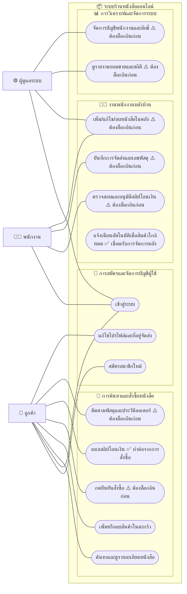

### 💡 2. Class Diagram

**หน้าที่และความสำคัญ:** แผนภาพโครงสร้างเชิงสถิต (Static Diagram) ที่ระบุคุณลักษณะ (Attributes) วิธีการทำงาน (Methods) รวมถึงตรรกะความสัมพันธ์เชื่อมโยงของข้อมูลวัตถุ (Entities Relationship)

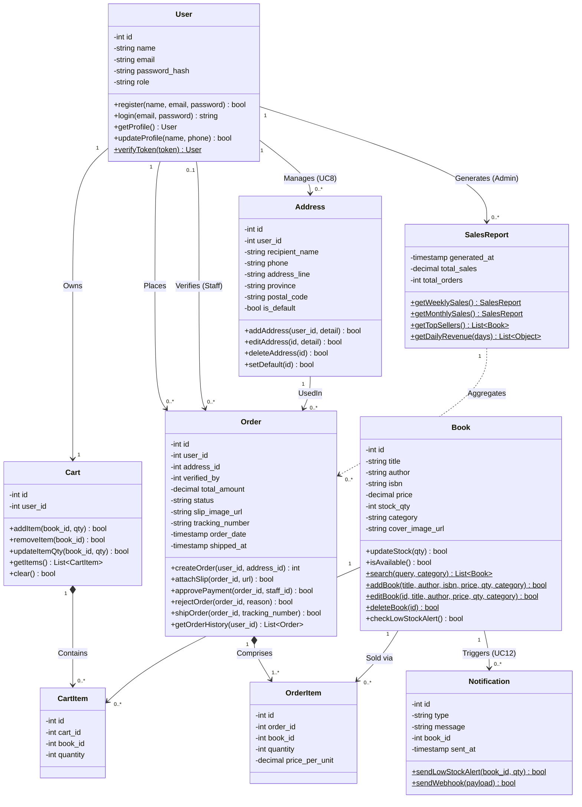

### 💡 3. Sequence Diagram

**หน้าที่และความสำคัญ:** แผนภาพจำลองตามลำดับกิจกรรมและทิศทางการส่งข้อมูลเมสเซจ (Messages Payload) ระหว่างวัตถุองค์ประกอบต่างๆ ของชิ้นงานตามลำดับเงื่อนไขของเวลา

### 🔐 3.1 UC1 & UC2: การสมัครสมาชิกและการเข้าสู่ระบบ (Register & Login Flow)
กระบวนการ **UC1: สมัครสมาชิกใหม่ (Register)** และ **UC2: เข้าสู่ระบบ (Login)** เพื่อรับสิทธิ์การใช้งานผ่าน JWT Token:

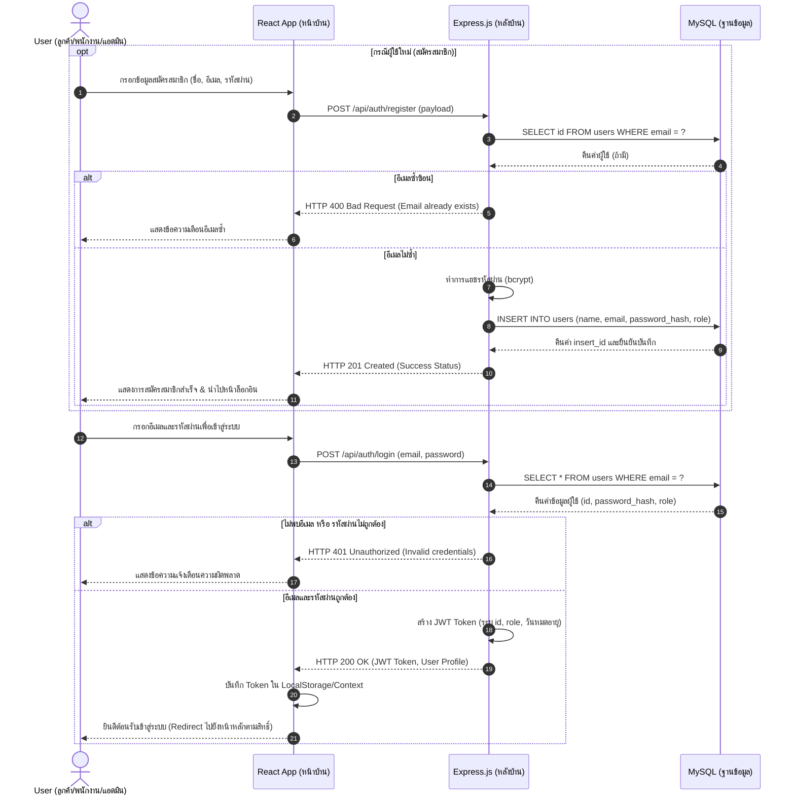

### 👤 3.2 UC3: การแก้ไขโปรไฟล์และที่อยู่จัดส่ง (Edit Profile & Address Flow)
ขั้นตอน **UC3: แก้ไขโปรไฟล์และที่อยู่จัดส่ง** ที่ลูกค้าสามารถอัปเดตข้อมูลส่วนตัวและจัดการที่อยู่จัดส่งได้:

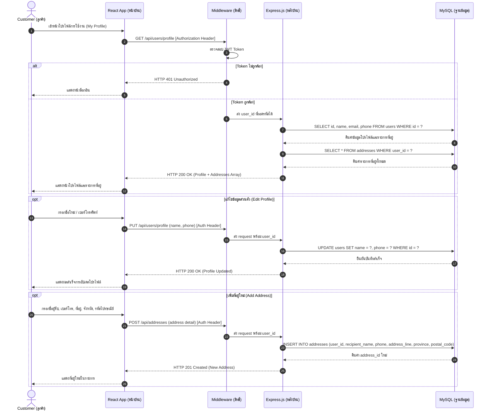

### 🛒 3.3 UC4 & UC5: การค้นหาหนังสือและจัดการตะกร้าสินค้า (Search & Cart Flow)
ขั้นตอน **UC4: ค้นหาและดูรายละเอียดหนังสือ** และ **UC5: เพิ่มหรือลบสินค้าในตะกร้า** พร้อมตรวจสอบ Auth และจำนวนคลังสินค้า:

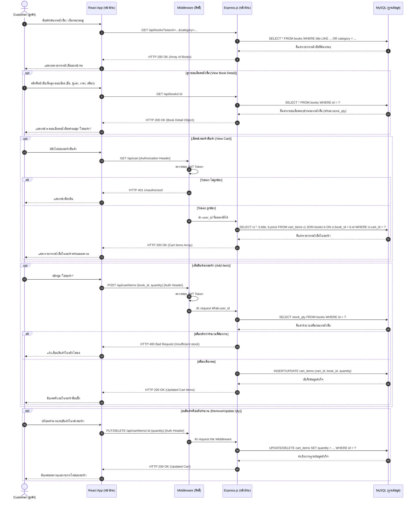

### 💳 3.4 UC6: การยืนยันสั่งซื้อหนังสือพร้อม Pessimistic Locking (Checkout Flow)
ขั้นตอน **UC6: กดยืนยันสั่งซื้อ** ที่มีการล็อคข้อมูลจำนวนสต็อกในตารางเพื่อป้องกันสภาวะชิงข้อมูล (Race Condition):

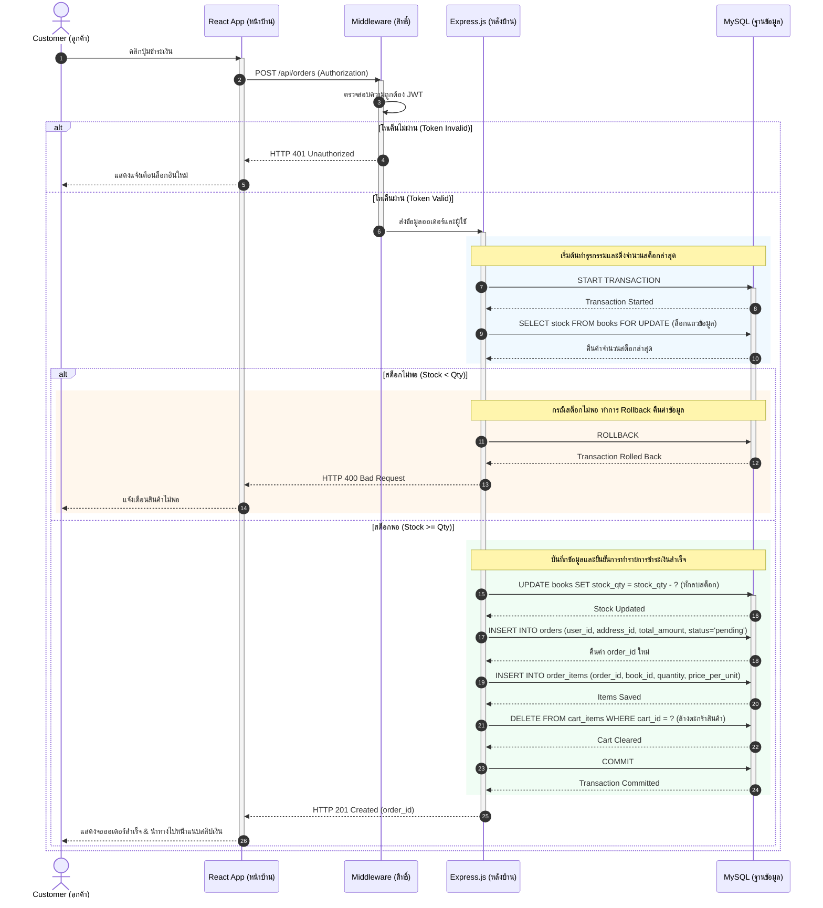

### 📄 3.5 UC7: การแนบหลักฐานการชำระเงิน (Upload Payment Slip Flow)
ขั้นตอน **UC7: แนบสลิปโอนเงิน** ที่ลูกค้าอัปโหลดรูปภาพสลิปเงินเพื่อผูกกับใบสั่งซื้อค้างจ่าย:

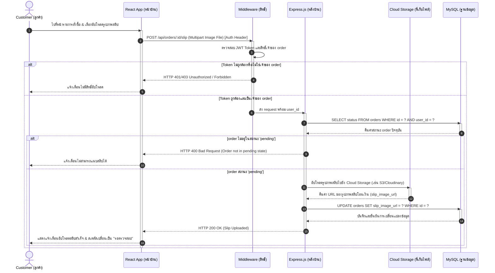

### 📦 3.6 UC8: ติดตามพัสดุและประวัติออเดอร์ (Order History & Tracking Flow)
ขั้นตอน **UC8: ติดตามพัสดุและประวัติออเดอร์** ที่ลูกค้าสามารถดูสถานะและรายละเอียดใบสั่งซื้อทั้งหมด:

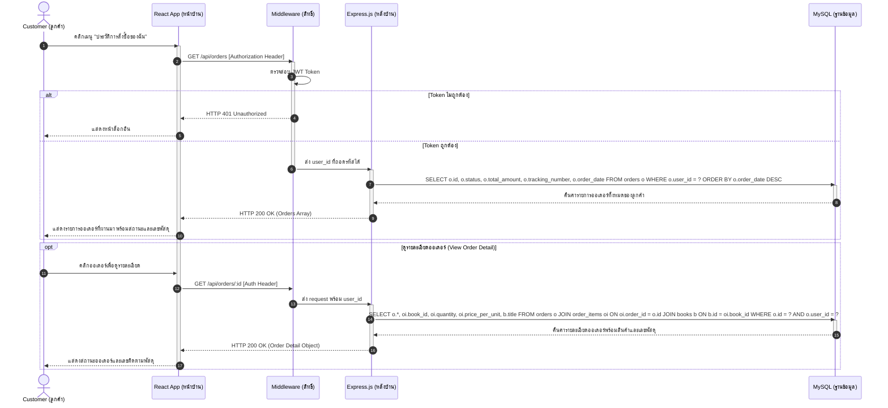

### 📦 3.7 UC9 & UC10: การตรวจสอบสลิปและการบันทึกจัดส่ง (Verify Slip & Ship Order Flow)
ขั้นตอน **UC9: ตรวจสอบและอนุมัติสลิปโอนเงิน** โดยพนักงาน และ **UC10: บันทึกการจัดส่งและเลขพัสดุ** พร้อม Tracking Number:

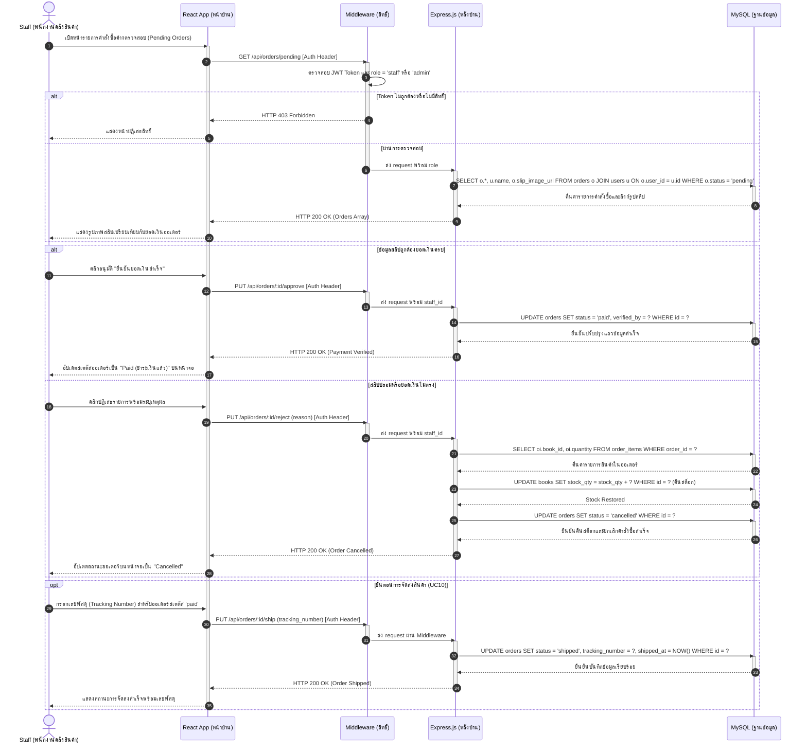

### ⚙️ 3.8 UC11 & UC12: การบริหารคลังสินค้าและแจ้งเตือนสต็อกต่ำ (Manage Catalog & Stock Alert Flow)
ขั้นตอน **UC11: เพิ่ม/แก้ไข/ลบหนังสือในคลัง** โดยพนักงาน/แอดมิน และ **UC12: แจ้งเตือนอัตโนมัติเมื่อสินค้าใกล้หมด**:

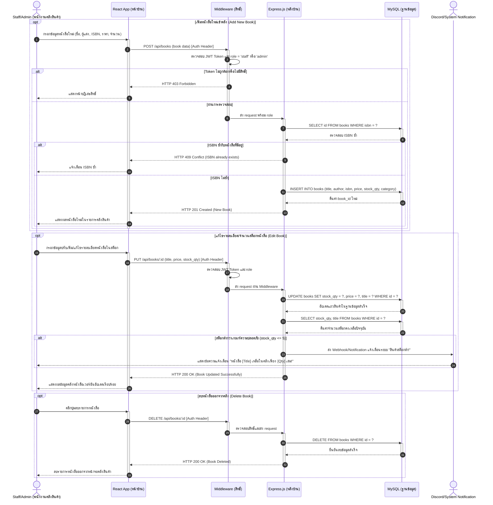

### 📊 3.9 UC13 & UC14: รายงานสรุปยอดขายและจัดการผู้ใช้สำหรับผู้ดูแลระบบ (Dashboard & User Management Flow)
ขั้นตอน **UC13: ดูรายงานยอดขายและสถิติ** และ **UC14: จัดการบัญชีพนักงานและสิทธิ์** สำหรับผู้ดูแลระบบ:

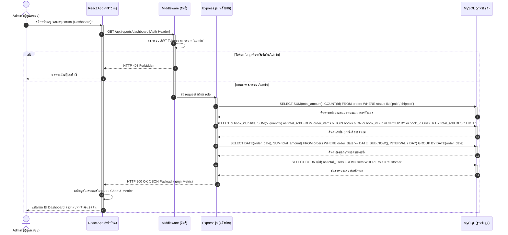

### 💡 4. Wireframe (Low-Fidelity)

**หน้าที่และความสำคัญ:** โครงร่างจัดวางองค์ประกอบหน้าต่างผู้ใช้ระดับต่ำ (Low-fidelity) เพื่อระบุตรรกะตำแหน่งการมองเห็นและโครงสร้างหน้าเว็บก่อนเริ่มเขียน HTML/CSS

```
┌─────────────────────────────────────────────────────────────┐
│  WIREFRAME: หน้าแรกระบบร้านหนังสือออนไลน์                    │
├─────────────────────────────────────────────────────────────┤
│  📚 BOOKSTORE    🔍 ค้นหาหนังสือ...    🛒 ตะกร้า (0) | Login │
├─────────────────────────────────────────────────────────────┤
│  ┌───────────┐  ┌───────────┐  ┌───────────┐               │
│  │  [Cover]  │  │  [Cover]  │  │  [Cover]  │               │
│  │           │  │           │  │           │               │
│  │  หนังสือ A │  │  หนังสือ B │  │  หนังสือ C │               │
│  │  250 บาท  │  │  320 บาท  │  │  190 บาท  │               │
│  │[+ ใส่ตะกร้า]│  │[+ ใส่ตะกร้า]│  │[+ ใส่ตะกร้า]│               │
│  └───────────┘  └───────────┘  └───────────┘               │
└─────────────────────────────────────────────────────────────┘
```

### 💡 5. Prototype (High-Fidelity)

**หน้าที่และความสำคัญ:** แบบจำลองหน้าต่างแอปพลิเคชันที่มีความเสมือนจริงสูง (High-fidelity) มีสีสัน กราฟิก และตอบสนองต่อการทดลองคลิกสลับหน้าจอ (Clickable Flow) เพื่อทำแบบทดสอบ UX Testing ก่อนสร้างชิ้นงานสมบูรณ์

> **Figma Interactive Prototype:** [คลิกเพื่อเปิดทดลองใช้งานบน Figma](https://www.figma.com/make/sfQBdsZm0zQ2XW9xZZv85Y/E-Commerce-Bookstore-Wireframe?t=5LqLUcmW0jqEUlre-1)

ความแตกต่างจาก Wireframe:
* มีการใช้สีสัน Gradient และ Typography ตาม Design System จริง
* แสดงชื่อหนังสือ ราคา และปุ่มสั่งซื้อด้วย Style ของ Production
* รองรับ Clickable Flow ระหว่างหน้าจอต่างๆ ของระบบ
* ใช้สำหรับการทดสอบ UX และรับ Feedback จากผู้ใช้จริงก่อนเขียนโค้ด

---

## คำถาม 3: การวิเคราะห์ปัญหาและการทดสอบระบบ (1 คะแนน)

> **กรณีสมมติ:** ในช่วงแคมเปญส่งเสริมการขายลดราคาพิเศษครั้งใหญ่ (Flash Sale) มีปริมาณลูกค้าหลั่งไหลเข้าสู่เว็บไซต์เป็นจำนวนมาก ส่งผลเกิดปัญหาคอขวดระบบล่าช้า (API Response Latency) และเกิดการปฏิเสธการให้บริการในที่สุด

### 🛠️ 1. เครื่องมือตรวจสอบวิเคราะห์และหาสาเหตุของปัญหา

* **Chrome DevTools (Network Panel):** ใช้ตรวจสอบและจำแนกเวลาแฝงค่าน้ำหนักฝั่งไคลเอนต์ (Client-Side Latency) โดยจับตาดูเวลาการรอคอยข้อมูลตอบกลับตัวแรก (Time to First Byte - TTFB) เพื่อหา Endpoint ที่ช้าที่สุด
* **Morgan หรือ Winston Middleware Library:** เครื่องมือตัวบันทึกข้อมูลฝั่งเซิร์ฟเวอร์ (Server Logging) เพื่อสแกนดูประวัติระยะเวลาการ Query ข้อมูลในเลเยอร์ฐานข้อมูล
* **Postman (Load Testing Tools):** ใช้จัดทำสภาพแวดล้อมจำลองการส่งคำขอปริมาณมหาศาลพร้อมๆ กัน (Virtual Users Load) เพื่อตรวจสอบหาจุดวิกฤตที่รับไม่ไหว (System Break-point)

### 🔄 2. ขั้นตอนการดำเนินงานแก้ไขปัญหา

1. **ระบุจุดคอขวด (Identify Bottleneck):** เปิด Network Tab จำแนกเส้นทางที่มีความล่าช้าสูง เช่น `POST /api/orders` สังเกตสเตตัสข้อผิดพลาดหากเกิดระบบทำงานเกินกำลังจนขึ้น 504 Gateway Timeout
2. **วิเคราะห์บันทึกฝั่งฐานข้อมูล (Database Trace):** เช็กประวัติ Logs ดูว่ากระบวนการสั่งซื้อค้างอยู่ที่ขั้นตอนใด หากพบว่าช้าตรงส่วนการค้นหาหนังสือ แสดงว่าระบบฐานข้อมูลกำลังเจอปัญหาไร้ดัชนีนำทาง
3. **จำลองสถานการณ์เพื่อตรวจสอบ (Replicate & Confirm):** ใช้เครื่องมือจำลองโหลดส่งยอดคำขอในอัตราที่เพิ่มขึ้น เพื่อประเมินจำนวน Thread หรือพอร์ตเชื่อมต่อที่ค้างคา (Database Connection Leak)

### 💡 3. แนวทางการแก้ไขปัญหาทางวิศวกรรมเบื้องต้น

* **จัดทำ Database Indexing:** สร้างโครงสร้างดัชนี (Index) บนตารางข้อมูลร้านหนังสือ โดยเฉพาะคอลัมน์ที่ถูกเรียกค้นหาซ้ำๆ เช่น `book_id` หรือประเภทหมวดหมู่หนังสือ ช่วยให้ฐานข้อมูลสืบค้นได้เร็วขึ้นโดยไม่ต้องแสกนอ่านไฟล์ตารางทั้งหมด
* **ประยุกต์ใช้ระบบแคชความเร็วสูง (In-Memory Caching):** นำข้อมูลหนังสือที่ไม่ค่อยเปลี่ยนแปลง (เช่น รายชื่อหนังสือแนะนำ หน้าแคตตาล็อก) ไปเก็บไว้บนระบบ Memory Cache ความเร็วสูง เพื่อให้หน้าบ้านสามารถดึงผลลัพธ์ได้ทันที ลดภาระที่ฐานข้อมูลหลัก
* **การจัดการ Connection Pooling:** ปรับแต่งโครงสร้าง Pool จำนวนการต่อท่อเชื่อมต่อข้อมูลให้เหมาะสมยืดหยุ่น เพื่อจำกัดคิวและรองรับคำสั่งจากผู้ใช้จำนวนมากไม่ให้ไปยืนรอค้างจนหน่วยความจำ Server ทำงานหนักเกินพิกัด
