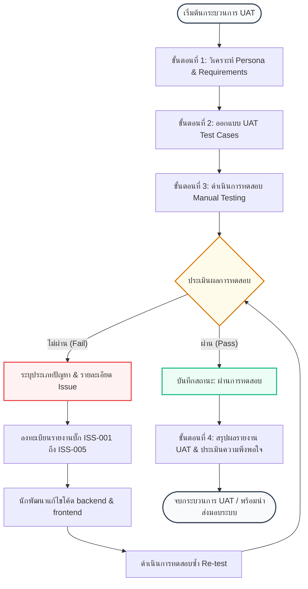

# 📝 Workshop #7: การออกแบบและดำเนินการทดสอบ User Acceptance Testing (UAT) (10 คะแนน)
> วิชา CSI204 ดิจิทัลแพลตฟอร์มสำหรับพัฒนาซอฟต์แวร์ • โครงงานระบบร้านหนังสือออนไลน์ (Online Book Store System)

---

## 📌 วัตถุประสงค์ของกิจกรรม
1. **ประเมินความพร้อมก่อนส่งมอบ:** เพื่อทดสอบและประเมินความถูกต้อง สมบูรณ์ และความเสถียรของระบบร้านหนังสือออนไลน์ในขั้นตอนสุดท้ายก่อนส่งมอบโครงงาน
2. **เชื่อมโยงการออกแบบกับการทดสอบ:** เพื่อนำเอาวิเคราะห์ผู้ใช้งาน (Persona) และความต้องการระบบ (Requirement) ที่ออกแบบไว้ในตอนแรกมาแปลงเป็นกรณีทดสอบที่สอดคล้องกับพฤติกรรมจริงของผู้ใช้
3. **ฝึกทักษะกระบวนการ UAT ตามกรอบ SDLC:** เพื่อเรียนรู้การจัดทำเอกสารการทดสอบระบบ คัดกรองและบันทึกรายงานปัญหา (Issue Logging) และวิเคราะห์แนวทางแก้ไขอย่างมีประสิทธิภาพ

---

## 👥 ขั้นตอนที่ 1: วิเคราะห์ Persona ระบุผู้ใช้งานหลัก
โครงงานระบบจำหน่ายหนังสือออนไลน์ประกอบด้วยผู้ใช้งานหลัก 3 กลุ่มที่มีบทบาทและเป้าหมายในระบบแตกต่างกันอย่างสิ้นเชิง:

1. **Customer (ลูกค้า):** ผู้ใช้งานที่เข้ามาเพื่อค้นหาหนังสือ เลือกหยิบสินค้าใส่ตะกร้า ชำระเงิน และติดตามสถานะพัสดุ
2. **Staff (พนักงานหลังบ้าน):** ผู้ใช้งานที่มีหน้าที่ตรวจสอบสลิปการโอนเงิน ตรวจสอบและอนุมัติคำสั่งซื้อ จัดเตรียมและจัดส่งหนังสือ ตลอดจนการตรวจนับและอัปเดตสต็อกในคลังสินค้า
3. **Manager (ผู้บริหาร/ผู้จัดการร้าน):** ผู้ใช้งานระดับบริหารที่ต้องการรายงานข้อมูลเชิงสถิติ เช่น ยอดขายรายวัน รายเดือน สถิติหนังสือที่ขายดี เพื่อนำไปใช้ตัดสินใจทางธุรกิจและวางแผนการจัดการร้านค้า

---

## 🔄 แผนภาพกระบวนการ UAT Workflow (UAT Process Flow)

ด้านล่างนี้คือแผนภาพขั้นตอนการดำเนินงานทดสอบ UAT และวงจรการแก้ไขข้อผิดพลาด (Bug Life Cycle) ที่เกิดขึ้นในระบบ:

---

## 🧪 ขั้นตอนที่ 2 & 3: การออกแบบ UAT Test Cases และการทดสอบจริง

บันทึกผลการทดสอบ User Acceptance Testing ทั้งหมด 12 รายการ แยกตามบทบาทผู้ใช้:

### 👤 Persona: Customer (ลูกค้า)

| รหัสทดสอบ | รายการทดสอบ | สถานะการทดสอบ | ปัญหา / ข้อผิดพลาด | รายละเอียดของปัญหา |
| :---: | :--- | :---: | :--- | :--- |
| **UAT-C01** | สมัครสมาชิก | 🟢 ผ่าน | ไม่มี | - |
| **UAT-C02** | เข้าระบบ | 🟢 ผ่าน | ไม่มี | - |
| **UAT-C03** | ค้นหาสินค้า | 🟢 ผ่าน | ไม่มี | - |
| **UAT-C04** | เพิ่มสินค้าในตะกร้า | 🟢 ผ่าน | ⚠️ ปัญหาเกี่ยวกับหน้าจอและการใช้งาน | ตัวอักษรแสดงผลและปุ่มกดบนมือถือมีขนาดเล็กเกินไป ส่งผลให้กดยากเล็กน้อย (แต่ฟังก์ชันหลักผ่าน) |
| **UAT-C05** | ชำระเงิน | 🔴 ไม่ผ่าน | 🚫 ระบบทำงานไม่ตรงตามความต้องการ | ลูกค้าสแกนคิวอาร์โค้ดแนบหลักฐานชำระเงินสำเร็จ แต่ในระบบหลังบ้านของร้านไม่มีรายการสั่งซื้อนั้นเกิดขึ้น (**ISS-001**) |

---

### 🧑‍💼 Persona: Staff (พนักงานหลังบ้าน)

| รหัสทดสอบ | รายการทดสอบ | สถานะการทดสอบ | ปัญหา / ข้อผิดพลาด | รายละเอียดของปัญหา |
| :---: | :--- | :---: | :--- | :--- |
| **UAT-S01** | ตรวจสอบคำสั่งซื้อ | 🔴 ไม่ผ่าน | 🚫 ระบบทำงานไม่ตรงตามความต้องการ | ยอดรวมของคำสั่งซื้อที่แสดงบนตารางผู้ใช้งานพนักงาน มีการคำนวณราคาสุทธิผิดพลาด (**ISS-002**) |
| **UAT-S02** | อัปเดตสถานะสินค้า | 🟢 ผ่าน | ไม่มี | - |
| **UAT-S03** | จัดการสต็อกสินค้า | 🔴 ไม่ผ่าน | ⚡ ปัญหาด้านประสิทธิภาพ | เมื่อเปิดคลังสินค้าที่มีข้อมูลหนังสือนำเข้ามากกว่า 10,000 เล่ม ระบบตอบสนองล่าช้าและหน้าจอบราวเซอร์ค้างชั่วขณะ (**ISS-003**) |

---

### ⚙️ Persona: Manager (ผู้บริหาร/ผู้จัดการร้าน)

| รหัสทดสอบ | รายการทดสอบ | สถานะการทดสอบ | ปัญหา / ข้อผิดพลาด | รายละเอียดของปัญหา |
| :---: | :--- | :---: | :--- | :--- |
| **UAT-M01** | เพิ่มข้อมูลสินค้า | 🟢 ผ่าน | ไม่มี | - |
| **UAT-M02** | แก้ไขข้อมูลสินค้า | 🟢 ผ่าน | ไม่มี | - |
| **UAT-M03** | ดูรายงานยอดขาย | 🔴 ไม่ผ่าน | 🚫 ระบบทำงานไม่ตรงตามความต้องการ | หน้าสรุปรายงานไม่ยอมแสดงรายการสั่งซื้อและยอดรวมแยกตามช่องทางการขาย (**ISS-004**) |
| **UAT-M04** | ดูแดชบอร์ดผู้บริหาร | 🔴 ไม่ผ่าน | 🗃️ ปัญหาเกี่ยวกับข้อมูล | สรุปรายงานจำนวนสต็อกรวมบน Dashboard ไม่ตรงกับปริมาณสินค้าที่พนักงานอัปเดตเข้าระบบจริง (**ISS-005**) |

---

## 📊 ขั้นตอนที่ 4: สรุปผลการทดสอบ (UAT Summary Metrics)

สถิติตัวเลขภาพรวมในการทดสอบ UAT ของระบบจำหน่ายหนังสือออนไลน์:

* **จำนวน Test Case ทั้งหมด:** 12 รายการ
* **สถานะ ผ่าน (Pass):** 7 รายการ (58.33%)
* **สถานะ ไม่ผ่าน (Fail):** 5 รายการ (41.67%)

### 📈 ตารางสรุปการทดสอบจำแนกตามผู้ใช้ (User Type Breakdown)

| สิทธิ์ผู้ใช้งาน (Persona) | จำนวนเคสทดสอบทั้งหมด | ผ่านการทดสอบ (Pass) | ไม่ผ่านการทดสอบ (Fail) | อัตราการผ่าน (Pass Rate) |
| :--- | :---: | :---: | :---: | :---: |
| **Customer** | 5 | 4 | 1 | 80.00% |
| **Staff** | 3 | 1 | 2 | 33.33% |
| **Manager** | 4 | 2 | 2 | 50.00% |
| **รวมทั้งหมด** | **12** | **7** | **5** | **58.33%** |

---

## 📝 ตารางสรุปปัญหาและข้อผิดพลาดที่พบ (Issue Registry)

รายการความบกพร่องของระบบที่จำเป็นต้องได้รับการแก้ไขอย่างเร่งด่วนก่อนนำระบบขึ้นใช้งานจริง (Go-Live Ready):

| รหัสข้อผิดพลาด | รายละเอียดของปัญหา | ประเภทปัญหา | ระดับความสำคัญ | อ้างอิงเคสทดสอบ |
| :---: | :--- | :--- | :---: | :---: |
| **ISS-001** | ลูกค้าโอนชำระเงินสำเร็จ แต่ระบบไม่สร้างใบสั่งซื้อ (Order Lost) | ระบบทำงานไม่ตรงตามความต้องการ | 🚨 Critical | UAT-C05 |
| **ISS-002** | ระบบหลังบ้านคำนวณราคาสุทธิผิดพลาดในระบบตรวจเช็กคำสั่งซื้อ | ระบบทำงานไม่ตรงตามความต้องการ | 🟠 High | UAT-S01 |
| **ISS-003** | หน้าต่างคลังสินค้าโหลดช้ามากเมื่อมีหนังสือจำนวนหลักหมื่นเล่มขึ้นไป | ปัญหาด้านประสิทธิภาพ | 🟡 Medium | UAT-S03 |
| **ISS-004** | รายงานการขายไม่แสดงยอดแยกหมวดหมู่และรายการสั่งซื้อของลูกค้า | ระบบทำงานไม่ตรงตามความต้องการ | 🟠 High | UAT-M03 |
| **ISS-005** | ข้อมูลสถิติตัวเลขแดชบอร์ดสรุปยอดสต็อกล่าช้าและไม่สอดคล้องกับพนักงานคลัง | ปัญหาเกี่ยวกับข้อมูล | 🟠 High | UAT-M04 |

---

## 🗣️ ตัวอย่างคำถามและแนวทางการชี้แจงในการนำเสนอโครงงาน (Final Project Defense QA)

ข้อมูลเตรียมความพร้อมเพื่อชี้แจงต่ออาจารย์ผู้ประเมินโครงงาน เมื่อถูกถามถึงประเด็นด้านความปลอดภัย ความเสถียร และแนวทางการรับมือข้อบกพร่อง:

### 💬 คำถามที่ 1: หากลูกค้ากดชำระเงินซ้ำๆ 5 ครั้ง ติดต่อกัน ระบบจะป้องกันอย่างไร?
* **คำตอบเชิงเทคนิค (Technical Answer):** 
  1. **ฝั่งหน้าบ้าน (Frontend):** เมื่อลูกค้าคลิกปุ่มชำระเงิน จะทำการเปลี่ยนสถานะปุ่มเป็น `disabled` และแสดงตัวโหลด (Loading Spinner) เพื่อไม่ให้ผู้ใช้สามารถคลิกซ้ำได้
  2. **ฝั่งหลังบ้าน (Backend):** ประยุกต์ใช้เทคนิค **Idempotency Key** และ **Request Debouncing** โดยใช้ Redis เป็นตัวจัดการ Lock ชั่วคราว (Distributed Lock) เป็นเวลา 10-15 วินาทีต่อคำสั่งซื้อ หากได้รับ Request ที่มีรหัสอ้างอิงตะกร้าเดียวกันเข้ามาในเสี้ยววินาที ระบบจะปฏิเสธคำขอที่ซ้ำซ้อนและส่งข้อความตอบกลับแจ้งผู้ใช้งาน

### 💬 คำถามที่ 2: หากการชำระเงินสำเร็จ (ยอดหักจากบัญชีแล้ว) แต่ Database เกิดล่มระหว่างนั้น จะเกิดอะไรขึ้นและจะรับมืออย่างไร?
* **คำตอบเชิงเทคนิค (Technical Answer):** 
  1. **การใช้งาน Database Transaction (ACID Properties):** ระบบจะใช้โครงสร้าง `START TRANSACTION` และมีการยืนยันการบันทึกด้วย `COMMIT` หากขั้นตอนใดใน API พังหรือ DB ล่ม จะทำการ `ROLLBACK` ทันที ข้อมูลจะไม่ค้างคาครึ่งๆ กลางๆ
  2. **ระบบ Event-driven & Message Queue:** การผูกการชำระเงินกับผู้ให้บริการภายนอก (Payment Gateway Webhook) จะทำผ่านแถวคอยข้อความ (เช่น RabbitMQ หรือ Webhook Retry Mechanism) ซึ่งหาก DB ล่ม Webhook จะพยายามส่งซ้ำ (Retry Policy) และระบบมีระบบประวัติ Log สำรอง (Audit Logs) บนไฟล์ภายนอก ทำให้สามารถกู้คืนสถานะธุรกรรมภายหลังได้ด้วยการนำข้อมูล Log มา Re-run

### 💬 คำถามที่ 3: หากสินค้าหมดระหว่างที่ลูกค้ากำลังทำรายการเช็คเอาท์ (Checkout) ระบบควรตอบสนองอย่างไร?
* **คำตอบเชิงเทคนิค (Technical Answer):** 
  1. **Optimistic Locking:** ใช้ฟิลด์ `version` หรือใช้คำสั่งตรวจสอบสต็อกในจังหวะอัปเดต เช่น `UPDATE books SET stock = stock - 1 WHERE id = :id AND stock >= 1`
  2. **Real-time Check:** ก่อนส่งหน้าเว็บไปสู่ขั้นตอนชำระเงิน ระบบ API `/api/orders/checkout` จะต้องดึงข้อมูลสต็อกปัจจุบันมาเทียบกับตะกร้าอีกครั้ง หากสินค้าไม่พอ จะขัดจังหวะการทำธุรกรรม (Abort) พร้อมแจ้งเตือนลูกค้าว่า "ขออภัย สต็อกสินค้าไม่เพียงพอ" และปรับจำนวนสต็อกในตะกร้าให้เป็นศูนย์หรือจำนวนคงเหลือจริงโดยอัตโนมัติ

### 💬 คำถามที่ 4: หากยอดเงินโอนที่ชำระมาไม่ตรงกับยอดเรียกเก็บจริงในระบบ จะมีวิธีการตรวจสอบและสกัดกั้นอย่างไร?
* **คำตอบเชิงเทคนิค (Technical Answer):** 
  1. **ใช้ยอดเงินโอนเศษสตางค์สุ่ม (Unique Cents):** เช่น ยอดสั่งซื้อ 300 บาท ระบบอาจให้โอน 300.12 บาท เพื่อเป็นตัวระบุและตรวจสอบยอดอัตโนมัติ
  2. **การรวมระบบ Payment Gateway API:** หลีกเลี่ยงการใช้การตรวจเช็กสลิปภาพด้วยพนักงานอย่างเดียว โดยหันไปใช้ Dynamic QR Code (PromptPay Bot / K-Payment Gateway) ซึ่งเป็นการยิงเช็คยอดเงินที่โอนเข้ามาตรงเข้ากับ API ธนาคาร หากยอดเงินที่ได้รับไม่ตรงกับยอดสั่งซื้อใน Database ระบบ Webhook จะไม่อนุมัติสถานะใบสั่งซื้อ และจะเปลี่ยนสถานะเป็น "ยอดเงินโอนไม่ตรง/รอตรวจสอบเพิ่มเติม" และส่งเมลแจ้งพนักงานทันที

### 💬 คำถามที่ 5: นักศึกษาได้ทดสอบกรณีผิดปกติ (Negative Test Case) อะไรบ้างในโครงการนี้?
* **คำตอบเชิงเทคนิค (Technical Answer):** 
  * **ระบบยืนยันตัวตน (Authentication Layer):** การเข้าสู่ระบบด้วยรหัสผ่านที่ผิดพลาดติดต่อกันเกิน 5 ครั้ง (Trigger Account Lockout 15 นาที), การป้อนข้อมูลอีเมลที่ไม่มีอยู่จริงหรือกรอกรูปแบบอีเมลไม่ถูกต้อง
  * **ส่วนแบ่งตะกร้าสินค้า (Cart Layer):** การพยายามป้อนข้อมูลจำนวนหนังสือเป็นลบ (Negative Quantity เช่น -5 เล่ม) หรือค่าที่ไม่ใช่ตัวเลข (NaN) เพื่อหวังปั่นราคาในระบบตะกร้า
  * **ระบบสั่งซื้อคลังสินค้า (Stock Over-order):** การส่ง Request ไปที่ API สั่งซื้อสินค้าในปริมาณที่เกินกว่าสต็อกปัจจุบัน เช่น หนังสือเหลือ 2 เล่มแต่กดสั่งซื้อ 100 เล่ม เพื่อทดสอบว่าเซิร์ฟเวอร์ส่งรหัส HTTP Status 400 Bad Request กลับคืนมาอย่างปลอดภัยหรือไม่
